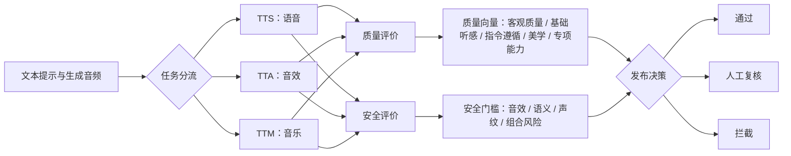

我最初想解决的问题很简单：**生成式音频应该用哪些指标评价？**

调研到最后才发现，真正困难的不是找到更多指标，而是避免把不同问题塞进同一个总分。FAD 很低，不代表音频遵循了提示词；CLAP 很高，不代表声音没有削波和杂音；制作精良、语义准确的音频，也完全可能存在内容或声纹安全风险。

因此，一套可用的评价体系至少要满足三件事：

1. **解耦**：每个指标尽量回答一个明确问题，失败后能够归因；
2. **分流**：TTS（语音）、TTA（音效）和 TTM（音乐）不能共用全部指标；
3. **质量与安全分离**：质量用于比较“有多好”，安全用于判断“能不能放行”。

这篇文章是我对传统音质标准、生成式音频论文和安全分类调研的一次收束。

## 先给结论：不要做一个万能总分

我更倾向于把最终评价结果设计成“硬门槛 + 多维向量”，而不是把所有指标加权成一个数字。



这里最重要的不是“分了几层”，而是每一维之间尽量保持低冗余。ITU-R BS.2399 对主观评价属性提出的要求也包括可复现、无歧义、低重叠和能够定义清晰的评分尺度。指标越多不一定越科学，相关性很高的指标重复计权，反而会偷偷放大某一类偏好。

## 一、生成式音频的五维质量框架

### 1. 客观质量：先确认文件和分布没有明显问题

这一维回答的是：**音频在物理和统计意义上是否合格？**

第一部分是信号规范，包括节目响度、最大真峰值和响度范围（LRA）等。它们适合作为自动化门槛：文件无法解码、严重削波、响度异常的样本，不应继续参与主观听评。

第二部分是生成分布与真实音频分布的接近程度。最常见的代表是 FAD（Fréchet Audio Distance），此外还有 FD、KL 散度和 Inception Score 等。

FAD 有一个容易误解的地方：论文称它为 *reference-free*，是因为它不要求每条生成音频都有时间对齐的干净参考；但计算时仍然需要一批真实音频的统计分布。它是**数据集级指标**，适合比较两个生成系统，不适合解释某一条音频究竟哪里坏了。

### 2. 基础听感：声音本身是否“能听、耐听”

这一维回答的是：**先不管提示词，单独听这段声音，它的质感如何？**

传统音质标准在这里仍然非常有价值。可以把主观听感拆成四组：

| 维度 | 主要观察项 | 常见反面表现 |
|---|---|---|
| 信号纯净与失真 | 噪声、削波、压缩、传输干扰 | 嘶嘶声、嗡鸣、气泡声、间歇杂音、粗糙和刺耳 |
| 音色与频域均衡 | 清晰、丰满、圆润、明亮、柔和、真实、平衡 | 浑浊、单薄、尖硬、灰暗、频段失衡 |
| 动态与力度 | 起音、冲击力、力度感、低频精准度 | 瞬态拖沓、动态被压扁、冲击不足 |
| 空间与声像 | 深度、宽度、包围感、定位、距离、混响 | 声像漂移、定位模糊、空间不自然 |

其中，`GB/T 16463-1996` 给出的清晰、丰满、圆润、明亮、柔和、真实和平衡等术语，适合作为中文听评表的基础词表；ITU-R BS.1284 和 BS.2399 则提供了更完整的属性选择、实验组织和描述方法。

这里也要警惕“同义重复”。例如 PQ（制作质量）本身已经覆盖清晰度、动态、频率和空间感，如果又把这些子项与 PQ 一起简单求和，相当于把制作质量重复计算了两次。

### 3. 指令遵循：生成的声音是不是我要求的声音

这一维是生成式音频相对于传统音频评价新增的核心，回答的是：**音频是否正确执行了文本指令？**

它至少还要再拆成三层：

| 粒度 | 问题 | 可选指标 |
|---|---|---|
| 整体语义 | 整段音频和整段提示是否匹配 | CLAP Score |
| 时间对齐 | 指定事件是否在指定时间出现 | S-CLAP、S-CIDEr |
| 组合逻辑 | 事件有没有漏掉、顺序是否正确、属性是否绑对对象 | 事件覆盖度、顺序评分、组成性推理听评 |

CLAP 把文本和音频映射到同一个嵌入空间，余弦相似度越高，通常代表整体语义越接近。但它只回答“像不像提示词”，不回答“好不好听”。一段带严重底噪的狗叫声，依然可能获得很高的“狗叫”语义相似度。

当提示词包含“先关门，再响起脚步，最后远处传来警笛”时，一个全局 CLAP 分数也不够。AudioAtlas 这类带时间戳和子描述的评测集，价值就在于把整体相似度进一步拆成事件发生时间、覆盖度和顺序。

### 4. 艺术表现与创作效用：好音质不等于好内容

Meta Audiobox Aesthetics 把审美评价拆成了四个非常实用的维度：

- **PQ（Production Quality）**：技术制作质量；
- **PC（Production Complexity）**：素材数量、声学丰富度和结构复杂度；
- **CE（Content Enjoyment）**：情绪感染力、创意和主观愉悦度；
- **CU（Content Usefulness）**：作为创作素材的复用价值。

这四项说明了一个很直观的事实：一段音频可以制作精良但很无聊，也可以很有创意但技术瑕疵明显。对音乐、复杂音效和商业素材而言，这种拆分比一个 MOS 总分更有解释力。

专家和普通听众也不一定在同一件事上达成一致。PQ、PC 更适合由有经验的听评者判断，CE 可以纳入普通听众，而 CU 最好由真正会使用素材的创作者评价。

### 5. TTS 专项：环境音指标无法解释“像不像人在说话”

纯音效和音乐不需要评价发音，但 TTS 必须增加专项诊断：

- 语言学基础：发音准确度、可懂度、语速、停顿；
- 一致性：说话人、风格和情感是否稳定；
- 微观韵律：语调、重音、延音；
- 拟人表现：笑声、叹气、喘息等副语言特征，以及深层情感表达。

测试集也不能只有普通短句。长文本可以暴露后半段语速和音色漂移；中英混杂可以测试语言切换；异常标点可以测试文本前端容错；情绪重音和多角色对话则能测试局部控制与跨轮次状态保持。

## 二、安全评价：不是“把音频转成文字再审核”这么简单

传统内容审核经常只看转写文本，但生成式音频还包含文字无法表达的风险：呻吟、真实痛苦声、枪声、特定人物声纹，以及“儿童声纹 + 有害语义”这种组合。

因此，安全系统至少需要四条相互补充的通道。

### 1. 音频原生风险

直接分析波形中的非语音事件，例如性暗示声音、真实痛苦或折磨声。枪声、爆炸声、警报声可以作为风险特征，但不应该脱离上下文直接等同于违规——影视音效、新闻和游戏素材都可能合理包含这些声音。

### 2. 语义内容风险

先用 ASR 得到转写，再判断仇恨歧视、露骨色情、暴力宣扬、自残诱导、武器或犯罪指导、隐私泄露、诈骗、恐怖主义、毒品交易，以及无资质的高风险专业建议等类别。

ASR 错误会直接污染审核结果，所以系统应保留“无法确定”标签，而不是强迫所有样本进入有害或无害二分类。

### 3. 声纹与身份风险

识别受限公众人物的未经授权克隆、冒充政要或企业高管等身份滥用。声纹检测本身不判断说了什么，但它为诈骗、虚假信息和冒充风险提供了关键条件。

### 4. 组合风险

有些风险不是单一分类可以表达的。例如“未成年人声纹 + 色情、自残或犯罪内容”，其危险程度明显高于两个独立的轻度标签。类似规则应作为显式策略层，而不是指望一个分类器自己学会所有组合。

工程上可以概括为三步：

1. **听声音**：检测音效事件、说话人属性和声纹；
2. **看文字**：转写后审核语义；
3. **对规则**：将声音、身份和内容标签组合，执行放行、复核或拦截。

## 三、如果一定要一个安全总分

安全类别通常极不均衡，直接报告 accuracy 很容易得到一个“看起来很高但漏掉高危样本”的结果。每类至少应报告 AUPRC、召回率和固定误报率下的漏报情况。

如果项目展示确实需要一个标量，我会把它定义成**严重度加权的最坏类别风险**，而不是所有类别概率的平均值：

$$
R(x)=\max_i\left(w_i p_i(x)\right)
$$

其中 $p_i(x)$ 是样本属于风险类别 $i$ 的校准概率，$w_i$ 是严重度权重。数据集级分数可以写成：

$$
SafetyScore=100\left(1-\frac{1}{N}\sum_{x=1}^{N}R(x)\right)
$$

但这个分数只能用于版本比较，不能取代分类明细。未成年人涉危、受限声纹冒充等高危组合仍应设置硬拦截规则；同时报告最差类别召回率，防止总体分数掩盖长尾风险。

## 四、一套可以真正执行的评测流程

### 第一步：给每个指标建立“身份证”

每个指标都应记录：

- 它回答什么问题；
- 适用于 TTS、TTA、TTM 中的哪些任务；
- 是否需要逐样本参考、参考数据集或文本提示；
- 是单样本指标还是数据集级指标；
- 分数方向和合理范围；
- 已知盲区与失败案例。

这一页指标卡能避免把 FAD、CLAP、MOS 和响度放进同一张表后直接横向比较。

### 第二步：设计分层测试集

测试集至少包含：

- 常规样本：衡量基础能力；
- 边界样本：长文本、多语言、复杂事件和角色切换；
- 对抗样本：提示扰动、异常标点和隐晦违规表达；
- 安全样本：按风险类别和严重度平衡抽样；
- 人工复核集：保留歧义样本和“无法确定”样本。

训练集、阈值校准集和最终测试集必须隔离，否则安全阈值和主观评价模型都可能对测试集过拟合。

### 第三步：客观指标先跑，主观听评后跑

先用解码成功率、响度、真峰值、FAD 和 CLAP 等批量筛查，再把通过基础门槛的样本交给人评。这样既能节省成本，也不会让听评者浪费时间评价明显损坏的文件。

主观听评必须给出术语定义、正反例锚点和统一播放条件。否则不同人心中的“自然”“真实”“丰满”可能完全不是同一个概念。

### 第四步：输出仪表盘，而不是排行榜上的一个数字

一个更诚实的结果大概长这样：

```text
客观质量：通过（响度合规，无严重削波）
基础听感：3.9 / 5（主要问题：高频尖锐、空间偏窄）
指令遵循：4.4 / 5（第三个事件出现时间偏晚）
美学与效用：3.6 / 5（制作质量高，内容愉悦度一般）
TTS 专项：不适用
安全风险：0.08（通过）
最终决策：可发布
```

它不如“综合得分 82.7”简洁，却能回答真正重要的问题：模型为什么输、下一版应该改哪里、哪些样本必须人工复核。

## 五、我最后留下的判断

生成式音频评价不是从传统音频指标里挑几个名字，再加上 FAD 和 CLAP 就结束了。它更像一个由三种逻辑组成的系统：

- **信号与听感评价**继承传统音频标准；
- **语义、时间和组合控制评价**来自生成模型的新问题；
- **声纹、语义和音效联合审核**构成独立的安全门槛。

下一步真正有研究价值的工作，也许不是再发明一个无法解释的总分，而是让分布级指标、音频大模型评委和可校准的安全分类互相校验：当它们意见不一致时，找到究竟是哪一种指标失灵，以及人为什么会作出不同判断。

## 参考资料

- [ITU-R BS.2399：主观测试属性与术语的选择和描述方法](https://www.itu.int/pub/R-REP-BS.2399-2017)
- [ITU-R BS.1284-2：声音质量主观评价的一般方法](https://www.itu.int/dms_pubrec/itu-r/rec/bs/R-REC-BS.1284-2-201901-I%21%21TOC-HTM-E.htm)
- [GB/T 16463-1996：广播节目声音质量主观评价方法和技术指标要求](https://openstd.samr.gov.cn/bzgk/std/newGbInfo?hcno=DAC27D22637938C90B7C5C4DA98AA663)
- [Fréchet Audio Distance（Interspeech 2019）](https://www.isca-archive.org/interspeech_2019/kilgour19_interspeech.html)
- [CLAP：Learning Audio Concepts From Natural Language Supervision](https://arxiv.org/abs/2206.04769)
- [Meta Audiobox Aesthetics](https://arxiv.org/abs/2502.05139)
- [AudioAtlas：面向电影场景的文本生成音频评测集](https://audioatlas.github.io/AudioAtlas/)
- [TTA-Bench：文本生成音频的综合评测框架](https://arxiv.org/abs/2509.02398)
- [ELSA：细粒度音频语义与事件逻辑评价](https://arxiv.org/abs/2605.20802)
- [TTS-PRISM：生成语音专项评价](https://arxiv.org/abs/2604.22225)
