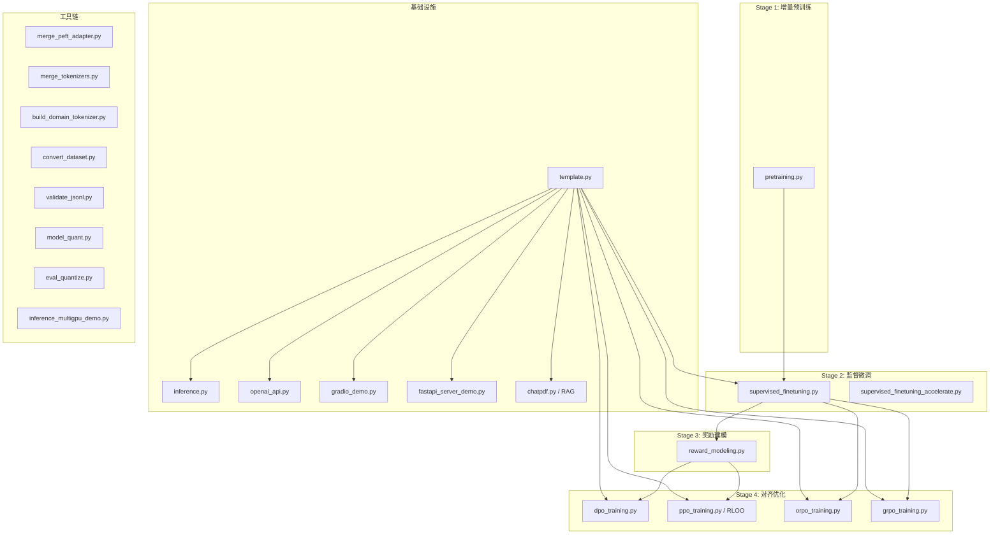
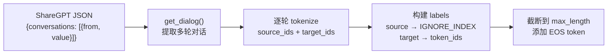
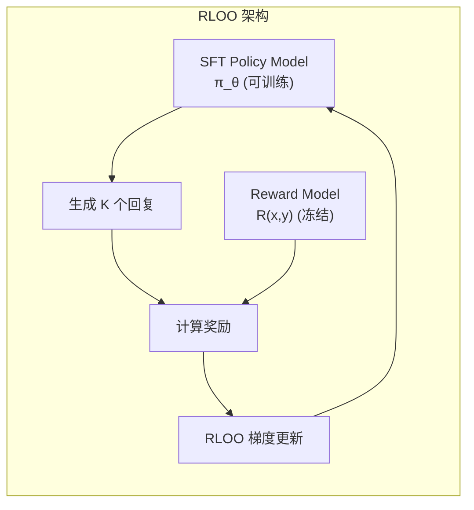
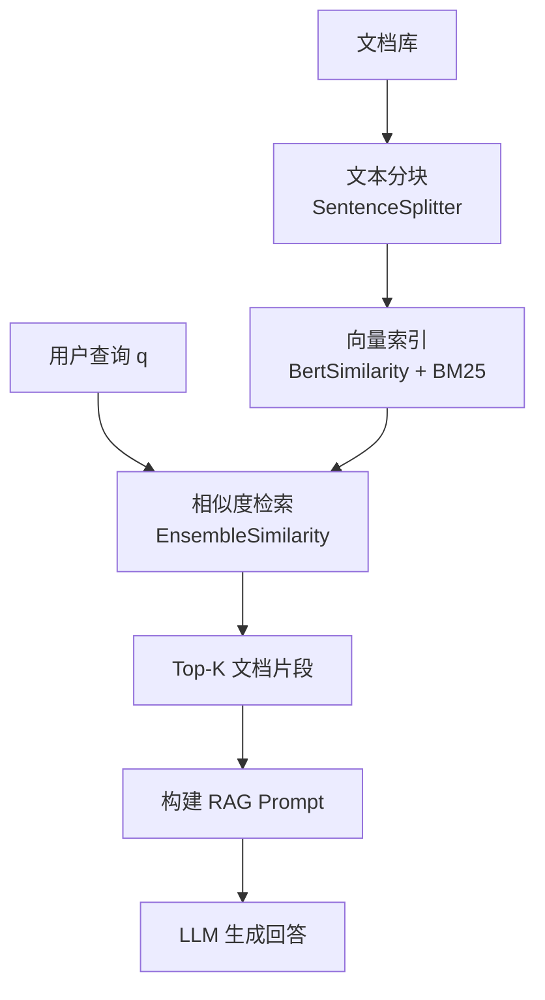
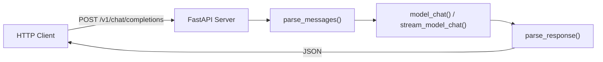
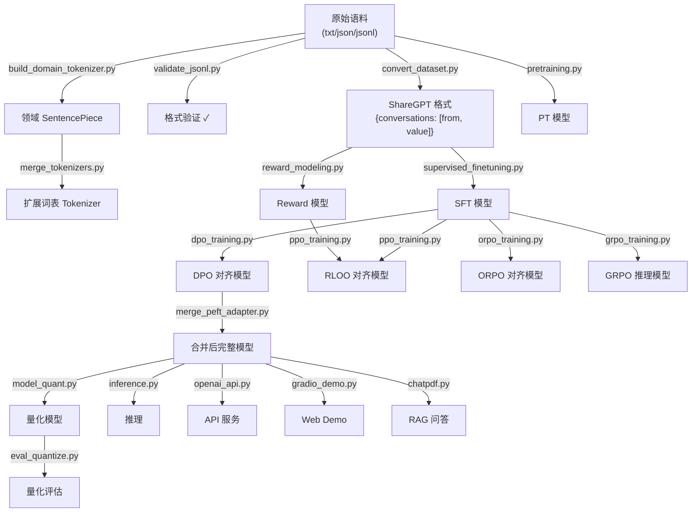

---

title: "MedicalGPT分析"
date: 2026-03-03T22:15:15+08:00
draft: false
categories: ["技术"]
tags: ["项目"]
lightgallery: true

---

## 项目介绍

是一个通过PT+SFT+RL在基座模型上对于垂直领域（医疗）的能力进行强化的案例，采用了30w的医疗百科数据与通用数据进行混合以及Lora的训练方法防止灾难性遗忘，RL阶段采用了GRPO  PPO  以及DPO三种算法，使用Ceval测试集配合Opencompass框架完成自动化测试同步在飞书上进行播报。可以尝试寻找数据将其迁移到其余垂直领域如法律交通等。


## 全局架构总览



**核心训练流水线**：

| 阶段 | 脚本 | 数学目标 | 输入数据格式 |
|------|------|----------|-------------|
| PT | `pretraining.py` | $\mathcal{L}_{\text{CLM}} = -\sum_t \log P(x_t \mid x_{<t})$ | 纯文本 |
| SFT | `supervised_finetuning.py` | $\mathcal{L}_{\text{SFT}} = -\sum_t \mathbb{1}[t \in \text{assistant}] \cdot \log P(x_t \mid x_{<t})$ | ShareGPT多轮对话 |
| RM | `reward_modeling.py` | $\mathcal{L}_{\text{RM}} = -\log\sigma(r_w - r_l)$ | 偏好对 (chosen/rejected) |
| DPO | `dpo_training.py` | $\mathcal{L}_{\text{DPO}} = -\log\sigma\left(\beta\log\frac{\pi_\theta(y_w\mid x)}{\pi_{\text{ref}}(y_w\mid x)} - \beta\log\frac{\pi_\theta(y_l\mid x)}{\pi_{\text{ref}}(y_l\mid x)}\right)$ | 偏好对 |
| RLOO | `ppo_training.py` | $\nabla_\theta J = \mathbb{E}\left[\left(R - \bar{R}_{-i}\right)\nabla_\theta\log\pi_\theta(y\mid x)\right]$ | Prompt + RM |
| ORPO | `orpo_training.py` | $\mathcal{L}_{\text{ORPO}} = \mathcal{L}_{\text{SFT}} + \lambda \cdot \mathcal{L}_{\text{OR}}$ | 偏好对 |
| GRPO | `grpo_training.py` | $\nabla_\theta J = \mathbb{E}\left[\sum_i \frac{R_i - \text{mean}(R)}{\text{std}(R)} \nabla_\theta \log\pi_\theta(y_i\mid x)\right]$ | 数学QA (GSM8K) |

---

## 面试速记：PT / SFT / RM / PPO / DPO / GRPO 怎么讲

如果面试官问大模型训练和对齐流程，不要一上来背技术名。先按一条主线讲：

```text
PT / 预训练：学语言和领域知识
SFT / 监督微调：学会按指令回答
偏好数据：告诉模型同一个问题下哪个回答更好
Reward Model：把回答质量变成一个标量分数
PPO / DPO / GRPO：让模型更偏向高质量回答，完成对齐
```

一句话总括可以这样说：

> PT 让模型有知识，SFT 让模型会对话，Reward Model 学会打分，PPO、DPO、GRPO 则是在不同资源和数据条件下把模型往人类偏好或任务奖励上对齐。

### 1. PT：预训练 / 增量预训练

PT 的目标是 **next-token prediction**，也就是给定前面的 token，预测下一个 token：

$$P_\theta(x_t \mid x_{<t})$$

损失函数是标准交叉熵 / 负对数似然：

$$\mathcal{L}_{\text{PT}} = -\sum_t \log P_\theta(x_t \mid x_{<t})$$

在 MedicalGPT 里，增量预训练就是继续用医学语料训练这个目标，让 Qwen 这类通用基座模型补充医疗领域知识。它不是教模型怎么回答用户，而是让模型先把医学术语、疾病描述、问诊表达这些分布学进去。

面试口径：

> 预训练本质上是因果语言模型的 next-token prediction。增量预训练是在通用模型基础上继续用领域语料训练同样的 CLM loss，让模型补充领域知识，但它还不能保证模型按照指令稳定回答。

### 2. SFT：监督微调

SFT 使用指令-答案数据，让模型模仿高质量回答。数据通常长这样：

```text
prompt: 请解释高血压的常见原因
answer: 高血压可能与遗传、饮食、肥胖、压力等因素有关...
```

损失函数依然是 token-level 交叉熵，但通常只在 assistant answer 部分计算 loss：

$$\mathcal{L}_{\text{SFT}} = -\sum_t \log P_\theta(y_t \mid x, y_{<t})$$

如果把用户输入部分 mask 掉，可以写成：

$$\mathcal{L}_{\text{SFT}} = -\sum_t \mathbb{1}[t \in \text{assistant}] \log P_\theta(x_t \mid x_{<t})$$

面试口径：

> SFT 可以理解成行为克隆。它用高质量指令-答案对让 base model 学会遵循指令、保持回答格式和对话风格。它的问题是只学习 chosen answer 本身，不知道两个回答之间谁更好，所以后面还需要偏好对齐。

### 3. 偏好数据和 Reward Model

偏好数据不是单个标准答案，而是一组三元组：

```text
x: prompt
y_w: chosen / winner / 更好的回答
y_l: rejected / loser / 更差的回答
```

Reward Model 输入 `prompt + response`，输出一个标量分数：

$$r_\phi(x, y) \in \mathbb{R}$$

训练目标是让 chosen 的分数高于 rejected。常用 Bradley-Terry pairwise loss：

$$\mathcal{L}_{\text{RM}} = -\log \sigma(r_\phi(x, y_w) - r_\phi(x, y_l))$$

直觉很简单：

```text
如果 r(chosen) 明显大于 r(rejected)，loss 小。
如果 r(rejected) 反而更高，loss 大。
```

模型结构上，Reward Model 往往是一个预训练 / SFT backbone 加一个 scalar reward head，不再输出词表概率，而是输出一个分数。

面试口径：

> Reward Model 是用 chosen/rejected 偏好对训练出来的评分模型。它输入 prompt 和 response，输出一个标量 reward，训练时用 pairwise ranking loss 让 chosen 的分数高于 rejected。训练好后，它可以作为 PPO 里的奖励函数，评价当前 policy 生成的回答。

### 4. PPO：经典 RLHF

PPO 是传统 RLHF 中最经典的一条路线。它通常包含四个模型：

| 模型 | 作用 |
|------|------|
| Policy / Actor | 要训练的大模型，负责生成回答 |
| Reference Model | 冻结的 SFT 模型，用 KL 约束 policy 不要跑偏 |
| Reward Model | 冻结的评分模型，给回答打分 |
| Value / Critic | 估计状态价值，用来计算 advantage |

流程是：

```text
1. 从 prompt 数据集中采样问题 x
2. policy model 生成回答 y
3. reward model 给回答打分 r(x, y)
4. 加上 KL 惩罚，避免模型偏离 reference model
5. 用 PPO clipped objective 更新 policy
```

实际奖励通常写成：

$$R = r_{\text{RM}}(x, y) - \beta \mathrm{KL}(\pi_\theta(y \mid x) \parallel \pi_{\text{ref}}(y \mid x))$$

PPO 的核心目标是 clipped objective：

$$\mathcal{L}_{\text{PPO}} = -\mathbb{E}\left[\min\left(\rho_t A_t, \mathrm{clip}(\rho_t, 1-\epsilon, 1+\epsilon) A_t\right)\right]$$

其中：

$$\rho_t = \frac{\pi_\theta(a_t \mid s_t)}{\pi_{\text{old}}(a_t \mid s_t)}$$

这里的 `ratio` 表示新策略相对旧策略变化了多少，`advantage` 表示这个动作比预期好不好，`clip` 用来限制每次更新幅度，避免策略一步改太猛。

面试口径：

> PPO 里 policy 负责生成回答，Reward Model 负责评价回答，Value Model 估计 advantage，Reference Model 用 KL 惩罚限制模型不要偏离 SFT 模型太远。PPO 的核心是根据奖励模型的分数更新 policy，同时用 clipped objective 保证训练稳定。

在这个项目里需要注意一点：文件名是 `ppo_training.py`，但当前文章分析到的具体实现更接近 RLOO。面试讲理论时可以讲 PPO 的标准 RLHF 框架；讲项目实现时再补一句“我也关注了 RLOO 这种去掉 value model 的简化策略”。

### 5. DPO：直接偏好优化

DPO 的目标是简化 PPO。它不显式训练 Reward Model，也不需要在线 RL 和 Value Model，只需要：

```text
1. Policy Model：要训练的模型
2. Reference Model：冻结的 SFT 模型
3. Preference Pair：chosen / rejected 偏好数据
```

DPO 的核心思想是：如果 chosen 比 rejected 好，那么当前模型应该比 reference model 更倾向 chosen，而不是 rejected。

损失函数：

$$\mathcal{L}_{\text{DPO}} = -\log \sigma\left(\beta\left[(\log \pi_\theta(y_w \mid x) - \log \pi_{\text{ref}}(y_w \mid x)) - (\log \pi_\theta(y_l \mid x) - \log \pi_{\text{ref}}(y_l \mid x))\right]\right)$$

其中：

```text
πθ：当前训练模型
πref：冻结参考模型
β：控制偏离 reference model 的强度
```

面试口径：

> DPO 是一种直接从偏好数据优化策略模型的方法。它绕过了显式 Reward Model 和 PPO 的复杂强化学习过程，直接提高 chosen response 的相对概率，降低 rejected response 的相对概率，同时通过 reference model 控制模型不要偏离 SFT 模型太远。

它和 SFT、PPO 的区别可以这么说：

| 方法 | 核心区别 |
|------|----------|
| SFT | 只学 chosen answer，不看 rejected |
| DPO | 同时看 chosen 和 rejected，学习相对偏好 |
| PPO | 先训练 Reward Model，再用 RL 优化 policy |

### 6. GRPO：组内相对策略优化

GRPO 可以理解成 PPO 的一种简化。它的关键点是：

```text
不用单独的 Value Model / Critic。
对同一个 prompt 采样多个回答。
用这一组回答的相对奖励计算 advantage。
```

流程：

```text
1. 给同一个问题 x，让模型生成 G 个回答
2. 每个回答得到一个 reward
3. 在组内计算均值和标准差
4. 高于组内平均的回答 advantage 为正
5. 低于组内平均的回答 advantage 为负
6. 用类似 PPO 的 clipped objective 更新模型
```

组内 advantage 常写成：

$$A_i = \frac{R_i - \mathrm{mean}(\{R_j\}_{j=1}^{G})}{\mathrm{std}(\{R_j\}_{j=1}^{G})}$$

GRPO 的目标函数可以粗略理解为：

$$\mathcal{L}_{\text{GRPO}} = -\mathbb{E}\left[\min\left(\rho_i A_i, \mathrm{clip}(\rho_i, 1-\epsilon, 1+\epsilon)A_i\right) - \beta \mathrm{KL}(\pi_\theta \parallel \pi_{\text{ref}})\right]$$

面试口径：

> GRPO 和 PPO 类似，都是策略优化方法，但 GRPO 不额外训练 value model，而是对同一个 prompt 采样多个回答，通过组内 reward 的均值和方差计算相对 advantage。这样可以降低训练成本，尤其适合数学、代码、推理这类可以用规则或结果验证打分的任务。

GRPO 的 reward 可以来自规则验证、Reward Model、格式奖励或人工偏好。在推理任务中，常见做法是同时给准确性奖励和格式奖励，例如答案是否正确、是否按 `<think>` 和 `<answer>` 格式输出。

### 7. 一张表背下来

| 阶段 | 数据 | 训练目标 | 是否需要 RM | 是否需要参考模型 | 面试关键词 |
|------|------|----------|--------------|------------------|------------|
| PT | 无标注文本 | next-token prediction | 否 | 否 | 学知识、学语言分布 |
| SFT | prompt-answer | 模仿标准答案 | 否 | 否 | 指令跟随、格式学习 |
| RM | chosen/rejected | 好回答分数高于坏回答 | 本身就是 RM | 否 | Bradley-Terry、pairwise loss |
| PPO | prompt + RM reward | 最大化 reward，KL 约束 | 是 | 是 | actor、critic、reward、reference |
| DPO | chosen/rejected | 直接优化偏好概率 | 否 | 是 | 直接偏好优化、离线对齐 |
| GRPO | prompt + 多个采样回答 | 组内相对 reward 优化 | 可选 | 通常需要 | 无 critic、组内 advantage |

### 8. 最好背的类比

```text
PT：读大量书，学语言和知识。
SFT：看标准答案，学怎么回答。
Reward Model：学会当评分老师。
PPO：学生写答案，评分老师打分，学生按分数改，但不能改太离谱。
DPO：不用评分老师，直接告诉学生 A 答案比 B 答案好。
GRPO：同一道题写多个答案，在这一组里比较谁更好，再强化好的答案。
```

如果明天只讲一段，可以这样说：

> 大模型对齐一般先 PT，再 SFT，再做偏好对齐。PT 用 next-token loss 学语言和知识；SFT 用指令-答案数据做监督学习，让模型学会按指令回答。传统 RLHF 会先用 chosen/rejected 偏好对训练 Reward Model，loss 是 $-\log\sigma(r_w-r_l)$，再用 PPO 根据奖励模型分数更新 policy，同时用 reference model 做 KL 约束、value model 估计 advantage。DPO 则不显式训练 Reward Model，而是直接在偏好对上提高 chosen 相对 rejected 的概率。GRPO 和 PPO 类似，但不训练 value model，而是对同一个 prompt 采样多个回答，用组内相对奖励计算 advantage，所以资源成本更低，也更适合推理类任务。

---

## 1. `template.py` — 对话模板系统

> [!IMPORTANT]
> 模板系统是整个项目的 **基石**。所有训练脚本和推理脚本都依赖 `get_conv_template()` 将对话历史序列化为模型可理解的字符串。

### 1.1 `Conversation` 数据类

```python
@dataclass
class Conversation:
    name: str            # 模板名称 e.g. "vicuna", "llama3", "qwen"
    system_prompt: str   # 系统提示词
    messages: List[Sequence[str]]  # [[query, answer], ...]
    roles: Sequence[str] # e.g. ("USER", "ASSISTANT")
    prompt: str          # 格式化模板 e.g. "USER: {query} ASSISTANT:"
    sep: str             # 轮次分隔符 e.g. "</s>"
    stop_str: str        # 停止标记
```

### 1.2 核心方法：`_format_example`

该方法将 `messages = [[q1, a1], [q2, a2], ...]` 转换为一个扁平的字符串列表 `[prompt1, response1, sep+prompt2, response2, ...]`。

**数学等价性**：对于 $n$ 轮对话，输出列表长度为 $2n$，其中：

$$\text{output}[2k] = \begin{cases} \text{system\_prompt} + \text{sep} + \text{prompt}(q_k) & \text{if } k = 0 \\ \text{sep} + \text{prompt}(q_k) & \text{if } k > 0 \end{cases}$$

$$\text{output}[2k+1] = a_k$$

`get_prompt()` 调用 `_format_example()` 后用 `"".join()` 拼接，得到一个完整的带格式的输入字符串。`get_dialog()` 则直接返回列表形式，供需要区分"人类话语"与"助手回复"的场景使用（如 PPO/RLOO 中提取 prompt）。

### 1.3 注册的模板

项目注册了 **20+** 种模板，覆盖主流中英文开源模型：

| 模板名 | 代表模型 | Prompt格式 | 分隔符 |
|--------|---------|-----------|--------|
| `vicuna` | Vicuna-7B/13B | `USER: {q} ASSISTANT:` | `</s>` |
| `alpaca` | Alpaca | `### Instruction:\n{q}\n\n### Response:\n` | `\n\n` |
| `llama3` | Meta-Llama-3-8B-Instruct | `<\|start_header_id\|>user<\|end_header_id\|>\n\n{q}<\|eot_id\|><\|start_header_id\|>assistant<\|end_header_id\|>\n\n` | `<\|eot_id\|>` |
| `qwen` | Qwen/Qwen2.5 | `<\|im_start\|>user\n{q}<\|im_end\|>\n<\|im_start\|>assistant\n` | `\n` |
| `chatml` | ChatML兼容模型 | 同Qwen | `<\|im_end\|>\n` |
| `chatglm3` | ChatGLM3-6B | `<\|user\|>\n{q}<\|assistant\|>` | `\n` |
| `deepseek3` | DeepSeek-V3 | `<｜User｜>{q}<｜Assistant｜>` | `</s>` |

> [!NOTE]
> 文件末尾重复注册了 `"deepseek"` 模板（第434行和第551行），后者会覆盖前者。这是代码中的一个小瑕疵。

---

## 2. `pretraining.py` — 增量预训练（Continue Pretraining）

### 2.1 数学目标

增量预训练使用标准的 **因果语言模型（Causal LM）** 目标：

$$\mathcal{L}_{\text{CLM}} = -\frac{1}{T}\sum_{t=1}^{T}\log P_\theta(x_t \mid x_1, x_2, \ldots, x_{t-1})$$

其中 $x_1, \ldots, x_T$ 是一个文本序列的 token，$\theta$ 是模型参数。

### 2.2 数据打包策略（Data Packing）

这是预训练脚本中最关键的设计决策。代码在 `group_text_function` 中实现了 **文档拼接+固定长度分块**：

```
文档A的tokens + [EOS] + 文档B的tokens + [EOS] + 文档C的tokens + [EOS] + ...
                                    |
                                    v
            [block_0: 0..block_size-1] [block_1: block_size..2*block_size-1] ...
```

**数学描述**：设有 $n$ 篇文档 $D_1, D_2, \ldots, D_n$，每篇文档被 tokenize 为 token 序列 $\mathbf{d}_i$。拼接操作为：

$$\mathbf{S} = \mathbf{d}_1 \oplus [\text{EOS}] \oplus \mathbf{d}_2 \oplus [\text{EOS}] \oplus \cdots \oplus \mathbf{d}_n \oplus [\text{EOS}]$$

其中 $\oplus$ 表示序列拼接。然后按 `block_size` 切分：

$$\text{Block}_k = \mathbf{S}[k \cdot B : (k+1) \cdot B], \quad k = 0, 1, \ldots, \lfloor|\mathbf{S}|/B\rfloor - 1$$

其中 $B$ 为 `block_size`。**最后不足一个块的尾部被丢弃**。

> [!TIP]
> 这种策略的优势在于 **100% GPU 利用率**——每个训练样本都恰好是 `block_size` 长度，无需 padding。缺点是跨文档边界的 token 可能产生虚假关联，但 EOS token 的插入在一定程度上缓解了这个问题。

### 2.3 LoRA/QLoRA 集成

代码支持三种训练模式：

| 模式 | 条件 | 可训练参数 |
|------|------|-----------|
| Full fine-tuning | `use_peft=False` | 100% 参数 |
| LoRA | `use_peft=True, qlora=False` | LoRA 适配器（`r × d_model` 低秩矩阵） |
| QLoRA | `use_peft=True, qlora=True` | 同 LoRA，但基座权重用 NF4 量化 |

LoRA 的数学原理：对于原始权重矩阵 $W_0 \in \mathbb{R}^{d \times k}$，引入低秩分解：

$$W = W_0 + \Delta W = W_0 + BA$$

其中 $B \in \mathbb{R}^{d \times r}$, $A \in \mathbb{R}^{r \times k}$, $r \ll \min(d, k)$。

实际前向传播为：

$$h = W_0 x + \frac{\alpha}{r} BAx$$

代码中 `lora_alpha` 对应 $\alpha$，`lora_rank` 对应 $r$。

### 2.4 `find_all_linear_names` 函数

当 `target_modules='all'` 时，此函数遍历模型找到所有线性层（排除 `lm_head` 和 `output_layer`），确保 LoRA 适配器应用于所有 attention 和 FFN 的投影矩阵：

$$\text{LoRA targets} = \{W_q, W_k, W_v, W_o, W_{\text{gate}}, W_{\text{up}}, W_{\text{down}}\}$$

### 2.5 `SavePeftModelTrainer` 自定义 Trainer

```python
class SavePeftModelTrainer(Trainer):
    def save_model(self, output_dir=None, _internal_call=False):
        # ...
        if isinstance(self.model, PeftModel):
            self.model.save_pretrained(output_dir)  # 只保存 LoRA 权重
```

关键设计：在 PEFT 模式下，只保存增量的 LoRA 权重（几十MB），而非完整模型权重（几GB~几十GB），大幅节省存储。

### 2.6 `fault_tolerance_data_collator`

```python
def fault_tolerance_data_collator(features):
    # If batch contains None, use the first valid sample to fill
    if not isinstance(features[0], Mapping):
        features = [features[0]] * len(features)
    # ...
```

容错数据整理器：当数据集中存在损坏样本时，用第一个有效样本替代，避免训练中断。这是一个工程上的 **鲁棒性保障**。

---

## 3. `supervised_finetuning.py` — 监督微调（SFT）

### 3.1 数学目标

SFT 的关键在于 **选择性交叉熵损失**——只在助手回复的 token 位置计算损失：

$$\mathcal{L}_{\text{SFT}} = -\frac{1}{|\mathcal{A}|}\sum_{t \in \mathcal{A}} \log P_\theta(x_t \mid x_{<t})$$

其中 $\mathcal{A} = \{t : \text{token}_t \text{ 属于助手回复}\}$。

### 3.2 数据处理：`preprocess_function`

这是整个 SFT 模块最复杂的部分。处理流程：



**逐轮处理的数学**：对于第 $i$ 轮对话（$i = 0, 1, \ldots, n-1$）：

1. **Source tokens**（人类问题）：$\mathbf{s}_i = \text{tokenize}(\text{dialog}[2i])$
2. **Target tokens**（助手回复）：$\mathbf{t}_i = \text{tokenize}(\text{dialog}[2i+1])$
3. **比例截断**：

$$\text{max\_source} = \left\lfloor L \cdot \frac{|\mathbf{s}_i|}{|\mathbf{s}_i| + |\mathbf{t}_i|} \right\rfloor, \quad \text{max\_target} = \left\lfloor L \cdot \frac{|\mathbf{t}_i|}{|\mathbf{s}_i| + |\mathbf{t}_i|} \right\rfloor$$

4. **Labels 构建**：

$$\text{labels}[j] = \begin{cases} \text{IGNORE\_INDEX} = -100 & \text{if } j \in \text{source positions} \text{ and } \neg\text{train\_on\_inputs} \\ x_j & \text{otherwise (target positions)} \end{cases}$$

> [!IMPORTANT]
> `IGNORE_INDEX = -100` 是 PyTorch 的 `CrossEntropyLoss` 的约定值。设为 -100 的位置在计算损失时被自动忽略，数学上等价于将这些位置的梯度归零：$\frac{\partial \mathcal{L}}{\partial \theta}\bigg|_{t \notin \mathcal{A}} = 0$

### 3.3 `DataCollatorForSeq2Seq` 配置

```python
data_collator = DataCollatorForSeq2Seq(
    tokenizer=tokenizer,
    model=model,
    label_pad_token_id=IGNORE_INDEX,        # padding 位置也用 -100
    pad_to_multiple_of=4 if right_pad,       # 对齐到4的倍数
)
```

`pad_to_multiple_of=4` 的设计是为了兼容 **Shifted Sparse Attention** 等高效注意力实现，它们要求序列长度是某个数的倍数。

### 3.4 内存优化技术

代码中集成了多种内存优化：

| 技术 | 代码位置 | 数学/工程效果 |
|------|---------|-------------|
| FlashAttention-2 | `attn_implementation="flash_attention_2"` | 计算复杂度 $O(N)$ 内存（vs 标准的 $O(N^2)$） |
| NEFTune | `neftune_noise_alpha` | 向 embedding 加噪：$\mathbf{e}' = \mathbf{e} + \frac{\alpha}{\sqrt{Ld}} \cdot \epsilon$, $\epsilon \sim \mathcal{U}(-1,1)$ |
| Gradient Checkpointing | `gradient_checkpointing_enable()` | 用计算换内存，激活值只保存检查点 |
| FP32 输出钩子 | `fp32_forward_post_hook` | `lm_head` 输出强制转FP32，避免混合精度下 logits 溢出 |

### 3.5 评估指标：困惑度

```python
perplexity = math.exp(metrics["eval_loss"])
```

困惑度（Perplexity）的数学定义：

$$\text{PPL} = \exp\left(-\frac{1}{T}\sum_{t=1}^{T}\log P_\theta(x_t \mid x_{<t})\right) = \exp(\mathcal{L}_{\text{CLM}})$$

PPL 越低，模型对测试数据的预测越准确。

---

## 4. `reward_modeling.py` — 奖励建模（Reward Modeling）

### 4.1 理论基础

奖励模型的训练基于 **Bradley-Terry 偏好模型**。给定一个 prompt $x$ 和两个回复 $y_w$（人类偏好的）、$y_l$（人类不偏好的），假设人类偏好概率为：

$$P(y_w \succ y_l \mid x) = \sigma(r_\theta(x, y_w) - r_\theta(x, y_l))$$

其中 $\sigma$ 是 sigmoid 函数，$r_\theta$ 是参数化的奖励函数（标量输出）。

### 4.2 损失函数实现

```python
class RewardTrainer(Trainer):
    def compute_loss(self, model, inputs, return_outputs=False, **kwargs):
        rewards_chosen = model(
            input_ids=inputs["input_ids_chosen"],
            attention_mask=inputs["attention_mask_chosen"],
        )[0]
        rewards_rejected = model(
            input_ids=inputs["input_ids_rejected"],
            attention_mask=inputs["attention_mask_rejected"],
        )[0]
        loss = -torch.nn.functional.logsigmoid(rewards_chosen - rewards_rejected).mean()
        # ...
```

**数学**：

$$\mathcal{L}_{\text{RM}} = -\mathbb{E}_{(x, y_w, y_l) \sim \mathcal{D}} \left[\log\sigma(r_\theta(x, y_w) - r_\theta(x, y_l))\right]$$

使用 `logsigmoid` 而非 `log(sigmoid())` 是为了 **数值稳定性**——避免 sigmoid 输出接近 0 时取对数产生 `-inf`。

`logsigmoid(z)` 的内部实现使用 log-sum-exp 技巧：

$$\log\sigma(z) = z - \log(1 + e^z) = -\log(1 + e^{-z})$$

### 4.3 模型架构

```python
model = AutoModelForSequenceClassification.from_pretrained(
    model_name_or_path,
    num_labels=1,  # 单一标量输出
    # ...
)
```

奖励模型将 Causal LM 的 `lm_head`（词汇表大小的输出层）替换为一个 **线性分类头**（`num_labels=1`），输出单一标量 $r \in \mathbb{R}$。

### 4.4 `RewardDataCollatorWithPadding`

```python
class RewardDataCollatorWithPadding:
    def __call__(self, features):
        # 将 chosen 和 rejected 分开 padding
        features_chosen = [{"input_ids": f["input_ids_chosen"], ...} for f in features]
        features_rejected = [{"input_ids": f["input_ids_rejected"], ...} for f in features]
        batch_chosen = self.tokenizer.pad(features_chosen, ...)
        batch_rejected = self.tokenizer.pad(features_rejected, ...)
        batch = {
            "input_ids_chosen": batch_chosen["input_ids"],
            "input_ids_rejected": batch_rejected["input_ids"],
            # ...
        }
```

关键设计：chosen 和 rejected 序列 **分别** padding 到各自批次的最大长度，而非统一 padding 到两者中较长的长度。这节省了内存和计算。

### 4.5 准确率指标

```python
def compute_metrics(eval_preds):
    # ...
    accuracy = np.sum(chosen_rewards > rejected_rewards) / len(chosen_rewards)
```

$$\text{Accuracy} = \frac{1}{N}\sum_{i=1}^{N}\mathbb{1}[r_\theta(x_i, y_w^i) > r_\theta(x_i, y_l^i)]$$

准确率反映奖励模型对人类偏好的拟合程度。高质量的 RM 准确率通常应 > 70%。

---

## 5. `dpo_training.py` — 直接偏好优化（DPO）

### 5.1 理论推导

DPO 的核心洞见是：最优奖励函数可以用策略模型和参考模型的对数似然比来表示：

$$r^*(x, y) = \beta \log\frac{\pi^*(y \mid x)}{\pi_{\text{ref}}(y \mid x)} + \beta\log Z(x)$$

将此代入 Bradley-Terry 模型的损失，得到 DPO 目标（$Z(x)$ 被消去）：

$$\boxed{\mathcal{L}_{\text{DPO}}(\theta) = -\mathbb{E}_{(x, y_w, y_l)}\left[\log\sigma\left(\beta\log\frac{\pi_\theta(y_w \mid x)}{\pi_{\text{ref}}(y_w \mid x)} - \beta\log\frac{\pi_\theta(y_l \mid x)}{\pi_{\text{ref}}(y_l \mid x)}\right)\right]}$$

### 5.2 实现细节

DPO 训练使用 `trl.DPOTrainer`，代码本身不需要显式实现损失函数——由 `trl` 库内部处理。代码的核心工作是 **数据准备**：

```python
def return_prompt_and_responses(examples):
    prompts = []
    for system, history, question in zip(...):
        history_with_question = history + [[question, '']]
        prompts.append(prompt_template.get_prompt(messages=history_with_question, ...))
    return {
        "prompt": prompts,
        "chosen": examples["response_chosen"],
        "rejected": examples["response_rejected"],
    }
```

DPO 数据格式：`{prompt, chosen, rejected}` 三元组。

### 5.3 参考模型处理

```python
trainer = DPOTrainer(
    model,
    ref_model=None if args.use_peft else deepcopy(model),  # !!!
    # ...
)
```

> [!IMPORTANT]
> **当使用 PEFT 时，`ref_model=None`**。这是因为 `trl.DPOTrainer` 的内部实现会自动使用 LoRA 的 **基座模型**（冻结参数）作为参考模型 $\pi_{\text{ref}}$。具体做法是：在计算参考模型的 log-probabilities 时，禁用 LoRA 适配器。
>
> 当进行全参数微调时，需要 `deepcopy(model)` 创建一份独立的参考模型副本。

### 5.4 DPOConfig 关键参数

```python
training_args = DPOConfig(
    max_length=full_max_length,   # prompt + response 的最大总长度
    beta=0.1,                      # DPO 温度参数 β（默认值，在ScriptArguments中可配置）
    # ...
)
```

$\beta$ 控制策略偏离参考模型的程度：
- $\beta \to 0$：忽略 KL 约束，策略完全追求奖励最大化
- $\beta \to \infty$：策略被钉死在参考模型上，不做任何更新

---

## 6. `ppo_training.py` — RLOO（REINFORCE Leave-One-Out）

### 6.1 从 PPO 到 RLOO

尽管文件名为 `ppo_training.py`，实际实现使用的是 **RLOO（REINFORCE Leave-One-Out）**——一种比 PPO 更简洁的策略优化算法。

**PPO 的问题**：需要额外训练一个 value model（价值网络），增加了内存和计算开销。

**RLOO 的优势**：不需要 value model，通过同一个 prompt 生成多个回复，用 leave-one-out 均值作为 baseline：

$$\nabla_\theta J = \mathbb{E}_{x \sim \mathcal{D}} \left[\sum_{i=1}^{K} \left(R(x, y_i) - \frac{1}{K-1}\sum_{j \neq i} R(x, y_j)\right) \nabla_\theta \log\pi_\theta(y_i \mid x)\right]$$

其中 $K$ 是每个 prompt 生成的回复数量。

### 6.2 架构



### 6.3 数据处理

PPO/RLOO 的数据格式与其他脚本不同——只需要 **prompt**，不需要预先准备 chosen/rejected：

```python
def preprocess_function(examples):
    # 从多轮对话中提取每轮的 human prompt
    for dialog in get_dialog(examples):
        for i in range(len(dialog) // 2):
            source_txt = dialog[2 * i]
            new_examples["prompt"].append(source_txt)
    return new_examples
```

### 6.4 Trainer 初始化

```python
trainer = RLOOTrainer(
    args=training_args,
    processing_class=tokenizer,
    model=policy,              # π_θ
    reward_funcs=reward_model, # R(x,y)
    train_dataset=train_dataset,
    eval_dataset=eval_dataset,
    peft_config=peft_config,
)
```

注意：`reward_funcs` 接受的是一个 `AutoModelForSequenceClassification` 实例——即第3阶段训练出的奖励模型。

---

## 7. `orpo_training.py` — ORPO（Odds Ratio Preference Optimization）

### 7.1 理论基础

ORPO 的核心创新：**将 SFT 和偏好对齐合并为一个损失**，无需参考模型。

定义 **odds ratio**（优势比）：

$$\text{OR}_\theta(y \mid x) = \frac{P_\theta(y \mid x)}{1 - P_\theta(y \mid x)}$$

ORPO 损失：

$$\mathcal{L}_{\text{ORPO}} = \underbrace{\mathcal{L}_{\text{SFT}}(y_w)}_{\text{SFT 项}} + \lambda \cdot \underbrace{\left(-\log\sigma\left(\log\frac{\text{OR}_\theta(y_w \mid x)}{\text{OR}_\theta(y_l \mid x)}\right)\right)}_{\text{Odds Ratio 对比项}}$$

### 7.2 实现关键

ORPO 的实现非常巧妙——它复用了 `trl.DPOTrainer`，只需要更改 `loss_type` 参数：

```python
training_args = DPOConfig(
    loss_type="orpo",         # 关键！使用 ORPO 损失
    beta=args.orpo_beta,       # 对应 λ（论文中的权重）
    # ...
)

trainer = DPOTrainer(
    model,
    args=training_args,
    # ref_model 不需要！ORPO 是 reference-free 的
    # ...
)
```

> [!TIP]
> ORPO 与 DPO 的关键区别：
> 1. **无需参考模型**（`ref_model` 不传入）
> 2. **同时优化 SFT 和对齐**（一阶段完成两个目标）
> 3. `beta` 参数的语义不同——在 ORPO 中是 SFT 损失的权重

### 7.3 注意：ORPO 的一个设计陷阱

代码中 `target_modules` 默认值为 `"all"`（第120行），这意味着 ORPO 默认会对 **所有线性层** 应用 LoRA。这与 DPO 的默认值 `None` 不同。

---

## 8. `grpo_training.py` — GRPO（Group Relative Policy Optimization）

### 8.1 理论基础

GRPO 用于训练类似 DeepSeek-R1 的推理模型。核心思想：对同一问题生成一组回复，用组内相对奖励来计算优势函数：

$$A_i = \frac{R_i - \text{mean}(\{R_j\}_{j=1}^G)}{\text{std}(\{R_j\}_{j=1}^G)}$$

策略梯度：

$$\nabla_\theta J = \mathbb{E}\left[\sum_{i=1}^{G} \min\left(\frac{\pi_\theta(y_i\mid x)}{\pi_{\text{old}}(y_i\mid x)}A_i, \; \text{clip}\left(\frac{\pi_\theta(y_i\mid x)}{\pi_{\text{old}}(y_i\mid x)}, 1-\epsilon, 1+\epsilon\right)A_i\right)\right]$$

### 8.2 奖励函数设计

GRPO 使用了两个 **规则化的奖励函数**（而非神经网络奖励模型）：

#### 8.2.1 准确性奖励 `accuracy_reward`

```python
def accuracy_reward(completions, answer, **kwargs):
    for content, sol in zip(contents, answer):
        gold_parsed = parse(sol.split("####", 1)[-1].strip())  # GSM8K 答案格式
        answer_parsed = parse(extract_answer(content))           # 从 <answer> 标签提取
        reward = float(verify(answer_parsed, gold_parsed))       # 数学验证
    return rewards  # 1.0 或 0.0
```

利用 `math_verify` 库对数学表达式进行符号级验证：不是简单的字符串匹配，而是真正的 **数学等价性检查**。

$$R_{\text{accuracy}}(y, y^*) = \begin{cases} 1.0 & \text{if } \text{verify}(\text{parse}(y), \text{parse}(y^*)) = \text{True} \\ 0.0 & \text{otherwise} \end{cases}$$

#### 8.2.2 格式奖励 `format_reward`

```python
def format_reward(completions, **kwargs):
    pattern = r"<think>.*?</think><answer>.*?</answer>$"
    rewards = [1.0 if re.match(pattern, content) else 0.0 for content in contents]
```

$$R_{\text{format}}(y) = \mathbb{1}[y \text{ 匹配 } \texttt{<think>...<\/think><answer>...<\/answer>} \text{ 格式}]$$

### 8.3 系统提示

```python
SYSTEM_PROMPT = (
    "...The reasoning process and answer are enclosed within "
    "<think> </think> and <answer> </answer> tags..."
)
```

这个系统提示引导模型使用 **Chain-of-Thought** 格式输出推理过程和最终答案。

### 8.4 与其他对齐方法的区别

| 特性 | DPO | RLOO | ORPO | GRPO |
|------|-----|------|------|------|
| 需要参考模型？ | ✅ | ✅ | ❌ | ✅ |
| 需要奖励模型？ | ❌ | ✅ | ❌ | ❌（规则奖励） |
| 需要偏好数据？ | ✅ | ❌ | ✅ | ❌ |
| 在线/离线 | 离线 | 在线 | 离线 | 在线 |
| 适合场景 | 通用对齐 | 通用对齐 | 无参考对齐 | 数学推理 |

---

## 9. `chatpdf.py` — RAG（检索增强生成）

### 9.1 架构



### 9.2 混合检索：`EnsembleSimilarity`

```python
m1 = BertSimilarity(model_name_or_path="shibing624/text2vec-base-multilingual")
m2 = BM25Similarity()
sim_model = EnsembleSimilarity(similarities=[m1, m2], weights=[0.5, 0.5], c=2)
```

**数学**：综合相似度得分为：

$$S_{\text{ensemble}}(q, d) = w_1 \cdot S_{\text{BERT}}(q, d) + w_2 \cdot S_{\text{BM25}}(q, d)$$

其中：
- $S_{\text{BERT}}$ 基于向量余弦相似度：$S_{\text{BERT}} = \frac{\mathbf{q} \cdot \mathbf{d}}{|\mathbf{q}||\mathbf{d}|}$
- $S_{\text{BM25}}$ 基于词频统计：$S_{\text{BM25}} = \sum_{t \in q} \text{IDF}(t) \cdot \frac{f(t,d)(k_1+1)}{f(t,d)+k_1(1-b+b\frac{|d|}{\text{avgdl}})}$

### 9.3 文本分块：`SentenceSplitter`

```python
class SentenceSplitter:
    def __init__(self, chunk_size=250, chunk_overlap=50):
```

分块策略：
1. **中文文本**：使用 `jieba` 分词，按句末标点 `{'。', '！', '？', '；', ...}` 断句
2. **英文文本**：使用正则 `(?<=[.!?])\s+` 按句断开
3. **重叠处理**：`chunk[i]` 的末尾与 `chunk[i+1]` 的开头有 `chunk_overlap` 个字符的重叠，避免关键信息被截断

### 9.4 RAG Prompt 模板

```python
RAG_PROMPT = """基于以下已知信息，简洁和专业的来回答用户的问题。
如果无法从中得到答案，请说 "根据已知信息无法回答该问题"...

已知内容:
{context_str}

问题:
{query_str}
"""
```

### 9.5 流式生成

```python
@torch.inference_mode()
def stream_generate_answer(self, ...):
    streamer = TextIteratorStreamer(tokenizer, timeout=60.0, ...)
    thread = Thread(target=self.gen_model.generate, kwargs=generation_kwargs)
    thread.start()
    yield from streamer
```

使用 **多线程 + TextIteratorStreamer** 实现流式输出：生成线程在后台逐 token 生成，主线程通过迭代器逐个 yield 给调用者。

---

## 10. `inference.py` — 推理脚本

### 10.1 两种推理模式

#### 单条流式推理 `stream_generate_answer`

```python
@torch.inference_mode()
def stream_generate_answer(model, tokenizer, prompt, device, ...):
    streamer = TextIteratorStreamer(...)
    thread = Thread(target=model.generate, kwargs=generation_kwargs)
    thread.start()
    for new_text in streamer:
        # 检查 stop_str，截断输出
        ...
```

#### 批量推理 `batch_generate_answer`

```python
def batch_generate_answer(sentences, model, tokenizer, system_prompt, ...):
    prompts = []
    for s in sentences:
        messages = [{"role": "user", "content": s}]
        prompt = tokenizer.apply_chat_template(messages, tokenize=False, ...)
        prompts.append(prompt)
    inputs_tokens = tokenizer(prompts, return_tensors="pt", padding=True)
    outputs = model.generate(input_ids=..., attention_mask=..., **generation_kwargs)
```

批量推理使用 `tokenizer.apply_chat_template`（HuggingFace 内置的模板系统），而非项目自定义的 `template.py`。这是因为较新的模型（如 Qwen2.5、Llama3）已经在 tokenizer 配置中自带了 `chat_template`。

### 10.2 交互模式

支持多轮对话，维护 `history` 列表。关键逻辑：

```python
if args.single_tune:
    history = []  # 单轮模式：每次清空历史
# 将 history 转为 messages 格式 [{role, content}, ...]
# 使用 apply_chat_template 生成完整 prompt
```

---

## 11. `openai_api.py` — OpenAI 兼容 API 服务

### 11.1 架构

基于 **FastAPI + Uvicorn** 提供 OpenAI ChatCompletion API 兼容接口。



### 11.2 ReAct 工具调用

代码实现了 **ReAct（Reasoning + Acting）** 框架的 Tool Calling：

```python
REACT_INSTRUCTION = """Answer the following questions as best you can...
Use the following format:
Question: ...
Thought: you should always think about what to do
Action: the action to take, should be one of [{tools_name_text}]
Action Input: the input to the action
Observation: the result of the action
...
Thought: I now know the final answer
Final Answer: ..."""
```

`parse_response()` 函数解析模型输出中的 `Action:` 和 `Action Input:` 字段，将其转换为 `tool_calls` 格式返回。

### 11.3 流式 SSE 响应

```python
async def stream_chat_completion(...):
    yield jsonify(chunk)  # delta messages
    # ...
    yield '[DONE]'  # SSE 终止信号
```

完全兼容 OpenAI 的 SSE（Server-Sent Events）流式协议。

---

## 12. `gradio_demo.py` & `fastapi_server_demo.py` — Web Demo

### 12.1 Gradio Demo

```python
gr.ChatInterface(
    predict,
    chatbot=gr.Chatbot(),
    title="MedicalGPT",
    theme="soft",
).queue().launch(share=args.share, ...)
```

使用 `gr.ChatInterface` 提供开箱即用的聊天界面。`predict` 函数是一个 **生成器**（`yield partial_message`），实现了逐字输出的打字机效果。

### 12.2 FastAPI Demo

```python
@app.post('/chat')
async def chat(item: Item):
    response = predict(item.input)
    return {'response': response}
```

极简的 REST API 接口，适合后端集成。

---

## 13. 工具链模块

### 13.1 `merge_peft_adapter.py` — LoRA 权重合并

**核心操作**：

$$W_{\text{merged}} = W_0 + \frac{\alpha}{r}BA$$

```python
base_model = new_model.merge_and_unload()
```

`merge_and_unload()` 将 LoRA 的增量权重 $\Delta W = BA$ 永久合并到基座权重中，得到一个普通的 Transformer 模型。

支持两种模型类型：
- `CAUSAL_LM`：用 `AutoModelForCausalLM`
- `SEQ_CLS`：用 `AutoModelForSequenceClassification`（奖励模型）

### 13.2 `merge_tokenizers.py` — 词表扩展

**数学/算法**：

1. 加载 LLaMA 的 SentencePiece 模型
2. 加载领域 SentencePiece 模型（由 `build_domain_tokenizer.py` 训练得到）
3. 取并集：$V_{\text{new}} = V_{\text{LLaMA}} \cup V_{\text{domain}} \cup V_{\text{Baichuan}} \cup V_{\text{jieba}}$
4. 新增 token 的 score 设为 0

```python
for p in chinese_spm.pieces:
    if piece not in llama_spm_tokens_set:
        new_p = sp_pb2_model.ModelProto().SentencePiece()
        new_p.piece = piece
        new_p.score = 0  # 新增词的得分为0
        llama_spm.pieces.append(new_p)
```

> [!WARNING]
> 扩展词表后，模型的 embedding 层维度会改变。需要使用 `model.resize_token_embeddings(new_vocab_size)` 来调整，新增 embedding 会被随机初始化。这正是 `inference.py` 中 `--resize_emb` 参数的作用。

### 13.3 `build_domain_tokenizer.py` — 领域分词器训练

使用 **SentencePiece BPE** 从领域语料训练分词器：

```python
spm.SentencePieceTrainer.train(
    input=args.in_file,
    model_type="BPE",
    vocab_size=2236,
    split_digits=True,
    byte_fallback=True,         # 对未知字符回退到字节级编码
    normalization_rule_name="nfkc",
)
```

BPE 算法的核心：

1. 初始化：每个字符为一个 token
2. 迭代：找到最频繁的相邻 token 对 $(t_i, t_{i+1})$，合并为新 token
3. 重复直到达到 `vocab_size`

### 13.4 `convert_dataset.py` — 数据格式转换

将 Alpaca 格式转换为 ShareGPT 格式：

```
Alpaca: {"instruction": "...", "input": "...", "output": "..."}
   ↓
ShareGPT: {"conversations": [{"from": "human", "value": "..."}, {"from": "gpt", "value": "..."}]}
```

### 13.5 `validate_jsonl.py` — 数据验证

检查 JSONL 文件的合法性：
- 每行是否为有效 JSON
- 是否包含 `conversations` 键
- `conversations` 是否为列表
- 每条对话是否有 `from` 和 `value` 字段
- `from` 值是否为 `system/human/gpt` 之一

### 13.6 `model_quant.py` — 模型量化

执行 NF4 量化并对比量化前后的效果：

```python
quantization_config = BitsAndBytesConfig(
    load_in_4bit=True,
    bnb_4bit_compute_dtype=torch.float16,
    bnb_4bit_quant_storage=torch.uint8,
    bnb_4bit_quant_type="nf4",
    bnb_4bit_use_double_quant=True,  # 双重量化
)
```

**NF4 量化数学**：NF4（NormalFloat 4-bit）假设权重服从正态分布 $\mathcal{N}(0, \sigma^2)$，使用 4-bit 量化格中均匀分布于正态分布 CDF 上的分位点：

$$q_i = \Phi^{-1}\left(\frac{2i+1}{2^{b+1}}\right), \quad i = 0, 1, \ldots, 2^b - 1$$

**双重量化**（double quantization）：对量化缩放因子本身再做一次量化，进一步压缩存储。

### 13.7 `eval_quantize.py` — 量化模型评估

计算量化模型的 **困惑度**（Perplexity）：

```python
def evaluate_perplexity(model, tokenizer, conversation_pairs):
    for input_text, target_text in conversation_pairs:
        outputs = model(input_ids=inputs, labels=target_ids)
        nlls.append(loss * target_ids.size(1))
    ppl = torch.exp(torch.stack(nlls).sum() / (n_samples * seqlen))
```

$$\text{PPL} = \exp\left(\frac{\sum_i \text{NLL}_i}{\text{total\_samples} \times \text{total\_length}}\right)$$

### 13.8 `inference_multigpu_demo.py` — 分布式推理

使用 `torchrun` + `DistributedSampler` 实现多 GPU 并行推理：

```python
dist.init_process_group(backend='nccl')
sampler = DistributedSampler(dataset, num_replicas=world_size, rank=local_rank)
# ...
dist.all_gather_object(all_inputs, inputs)      # 收集结果
dist.all_gather_object(all_responses, responses)
```

每个 GPU 处理数据的不同分片，最后通过 `all_gather_object` 汇总所有结果。

---

## 14. `supervised_finetuning_accelerate.py` — Accelerate 版 SFT

### 14.1 与标准 SFT 的区别

| 特性 | `supervised_finetuning.py` | `supervised_finetuning_accelerate.py` |
|------|---------------------------|--------------------------------------|
| 训练框架 | HuggingFace `Trainer` | HuggingFace `Accelerate` |
| 多GPU策略 | DataParallel / DDP | Accelerate自动管理 |
| 训练循环 | 自动（Trainer内部） | 手动（显式epoch/step循环） |
| 灵活性 | 低（框架约束） | 高（完全掌控训练逻辑） |

### 14.2 智能并行策略选择

```python
if is_distributed:
    if script_args.use_tensor_parallel and estimated_model_size_gb > 20:
        use_tensor_parallel = True   # 大模型用张量并行
    else:
        use_tensor_parallel = False  # 小模型用 DDP
```

代码会根据模型大小自动选择最优的并行策略，并根据模型名称中的参数量标识（如 "70b", "7b"）估算模型大小。

### 14.3 GPU 内存优化

```python
def check_and_optimize_memory():
    torch.backends.cuda.enable_flash_sdp(True)
    torch.backends.cuda.enable_mem_efficient_sdp(True)
```

自动启用 PyTorch 的 Flash SDP（Scaled Dot Product）和内存高效注意力实现。

---

## 15. 横切关注点（Cross-Cutting Concerns）

### 15.1 特殊 Token 处理策略

所有训练脚本都遵循统一的 token 处理模式：

```python
# 1. EOS token: 必须存在
if tokenizer.eos_token_id is None:
    tokenizer.eos_token = prompt_template.stop_str
    tokenizer.add_special_tokens({"eos_token": tokenizer.eos_token})

# 2. BOS token: 可选，默认复用 EOS
if tokenizer.bos_token_id is None:
    tokenizer.add_special_tokens({"bos_token": tokenizer.eos_token})

# 3. PAD token: 优先用 UNK，其次用 EOS
if tokenizer.pad_token_id is None:
    tokenizer.pad_token = tokenizer.unk_token or tokenizer.eos_token
```

> [!CAUTION]
> 使用 EOS 作为 PAD token 可能导致模型将 padding 位置误判为序列结束。在推理时需要确保 `attention_mask` 正确设置。

### 15.2 Gradient Checkpointing 与 KV Cache 的互斥

```python
if training_args.gradient_checkpointing:
    model.gradient_checkpointing_enable()
    model.config.use_cache = False    # 训练时必须禁用 KV cache
else:
    model.config.use_cache = True

# 训练结束后
model.config.use_cache = True  # 恢复 KV cache 以加速推理
```

**数学解释**：KV cache 保存历史 Key/Value 状态以加速自回归生成。但在训练时使用 gradient checkpointing（重计算中间激活值）时，保存的 KV cache 会与重计算产生不一致。

### 15.3 DeepSpeed ZeRO-3 兼容性

```python
if is_deepspeed_zero3_enabled():
    model_kwargs["low_cpu_mem_usage"] = False
    # ZeRO-3 不兼容 device_map
    # ZeRO-3 不兼容 QLoRA
```

ZeRO-3 将模型参数分片到多个 GPU 上。这与 `device_map="auto"`（将完整层放到不同 GPU）和 QLoRA（需要与量化结合）都不兼容。

### 15.4 MoE 模型特殊处理

```python
if "output_router_logits" in model.config.to_dict():
    logger.info("set output_router_logits to True for MoE model")
    model.config.output_router_logits = True
```

对于 Mixture-of-Experts 模型（如 Mixtral），需要启用路由器 logits 输出以计算辅助损失（auxiliary loss），让专家负载更均衡。

---

## 16. 总结：数据流全景



**项目的核心价值**：将 ChatGPT 训练范式的全部阶段——从数据预处理到增量预训练、监督微调、奖励建模、多种对齐算法、再到推理部署——整合在一个统一的代码库中，并通过共享的模板系统（`template.py`）和工具链实现了各模块间的无缝衔接。
