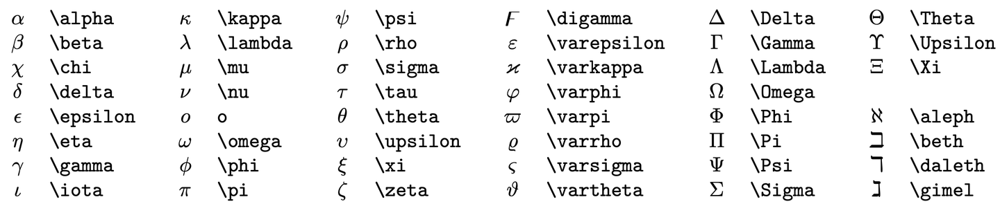

# Latex 用法

跟着B站视频_哔哩哔哩_bilibili](https://www.bilibili.com/video/BV1no4y1U7At/?spm_id_from=333.337.search-card.all.click&vd_source=3ecda433bad27ee4e395ad1ffebdd84b))练的

## 希腊字母

​	反斜杠+希腊字母的英文名

​	

## 上下标

​	与word一致

​		a^2  a_i              直立体写法：x_{\text i} 
$$
a^2   a_i   可以用括号将一个式子当成一个变量  a^{上下左右前后}   下标有斜体和直立体之分，斜体说明是第i个变量，直立体说明变量就叫x_{\text i}
$$

## 分式根式

​	\sqrt A		\frac A B  分别表示根号与分式，都支持嵌套
$$
\sqrt A       ＆   \frac A B
$$

## 运算符

​	四则运算中，加减保持原样就行  乘对应\times   除对应\div    点乘 对应 \cdot   正负号是\pm  负正号是\mp 
$$
+    -   \times \div \cot \pm  \mp
$$

​	在比较大小中 大于小于还是<>不变，大于等于为\ge  小于等于\le  远大于\gg 远小于\ll  不等于是\ne
$$
<>\ge\le\gg\ll\ne
$$
 

​	约等于是\approx  恒等于是\equiv 	
$$
\approx  \equiv
$$
​	交和并分别是\cup 和\cap 属于是\in  不属于是\notin 包含于是\subseteq 真包含于是\subsetneqq  空集是\varnothing
$$
\cup \cap \in  \notin \subseteq \subsetneqq	\varnothing
$$
​	任意是\forall  存在是\exists  不存在是\nexists 因为是\because  所以是\therefore  各种数集就是\+对应字母比如\R
$$
\forall \exists \nexists \because \therefore \R \N \Z
$$
两种F的表示分别为\mathcal F \mathscr F
$$
\mathcal F \mathscr F
$$
