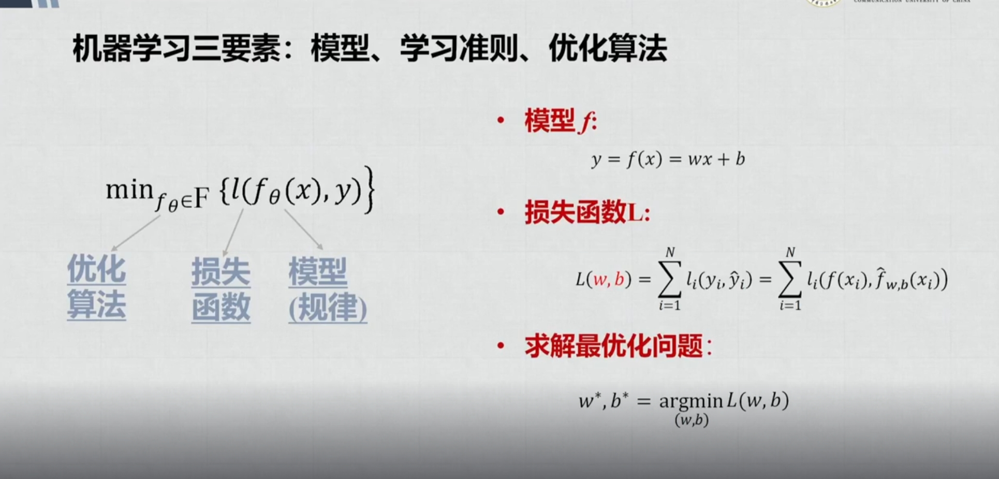
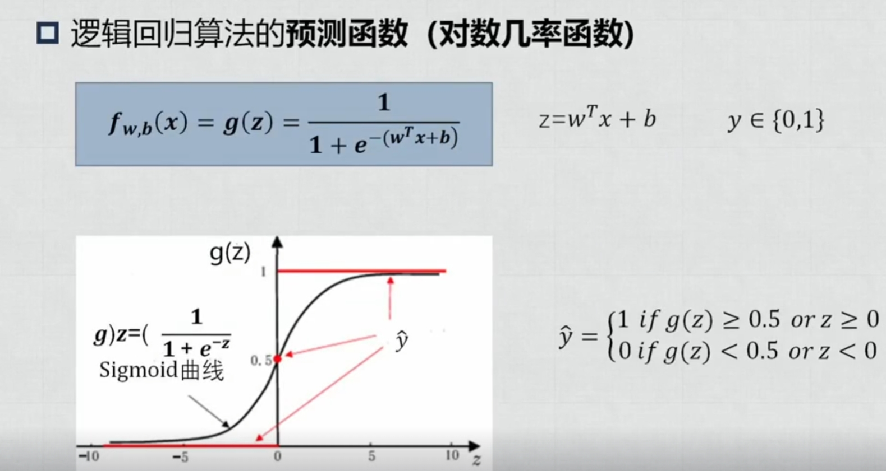
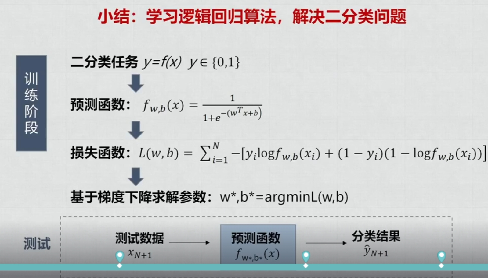
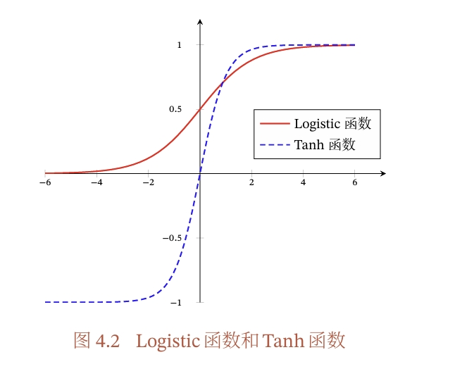
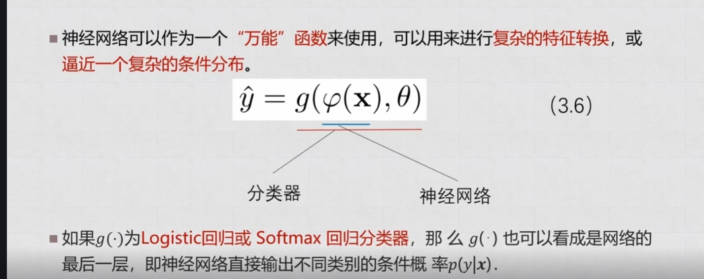
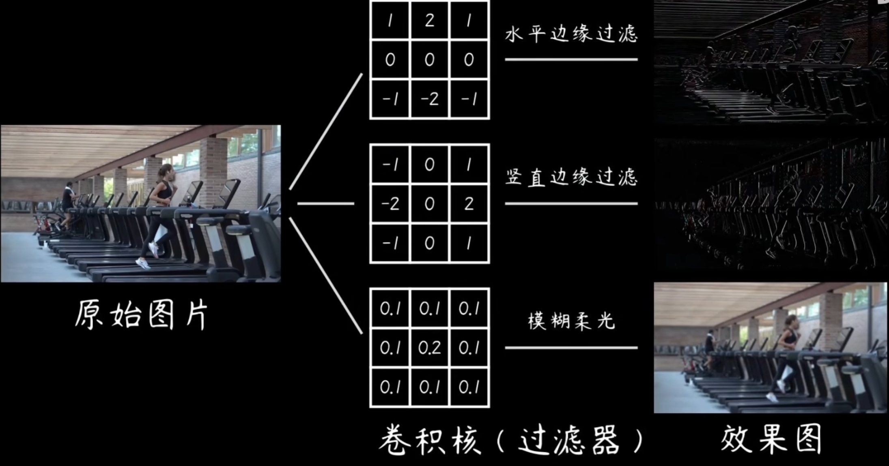

# Machine Learning

# 基础

## 目标

 机器学习的目标就是拟合一个函数能够完成预测问题

三要素：模型 学习准则 优化算法

学习算法一般分为三种

​	监督学习

​		回归问题	标签y是连续值	f(x,θ)输出也是连续值

​		分类问题	y是离散值

​		结构化学习问题	实质是特殊分类问题 标签Y通常是结构化的对象 序列 /树/图之类的

​	

​	无监督学习:从不包含目标标签的训练样本中自动学到有价值的信息

​		聚类 	密度估计	特征学习 	降维

​	强化学习：通过交互来学习的机器学习算法 	在和环境的交互中不断学习并且调整策略

### 特征表示

​	首先机器学习核心应该是数学运算，所以要把各种特征转化为向量来表示，方便计算

​		图像：M*N的图像 变为 M * N维的向量，每维的数值是灰度，如果是彩色图就RGB三层叠加

​		文本： 简单方式是用词袋（Bag of words)但好像由于不考虑词序，不能精确表示文本信息

​		特征学习 又称表示学习   让机器自动学习出有效特征

​				方式：用人为设计准则  通过准则选出需要的特征

### **梯度消失（Vanishing Gradient）**

#### **定义**

在反向传播时，梯度值随着网络层数增加呈指数级衰减，导致浅层（靠近输入层）的权重几乎不更新，训练停滞


 

**梯度爆炸（Exploding Gradient）**

#### **定义**

在反向传播时，梯度值随着网络层数增加呈指数级增长，导致权重更新幅度过大，模型参数发散（NaN 或溢出）。

## 数据增广

扩充数据集：比如对已有图片加入噪声 镜像旋转 

​			可以遇到更加多样化的情况提升降低过拟合风险

## 微调

通过大数据集训练出来的模型用在小数据集上

因为大的数据集训练出来的初始模型泛化能力一般会强一点，所以用来初始化参数（反正肯定比随机设参数强）

那么在复制参数的时候，是不是一模一样复制呢：在神经

## 两条定律

没有免费午餐定律：炉石传说没有完爆

奥卡姆剃刀原理：简单的模型泛化能力更强	没必要不要增实体

# 各种问题

### 一元

predict	



​	在计算损失函数的时候，loss=yi-(wxi+b)，由于只是把标签值yi和输入值xi带入了，所以loss是关于两个参数的方程，可以计算最小值梯度等问题，当使用线性模型的时候会出现离群点，损失函数可以换成别的函数均方误差受到的影响太大

### 二分类问题

​	样本空间中找到一个超平面 它将特征空间一分为二 一半是我愿意 一半是我拒



​	在分类问题中不能用线性模型的输出，或者说不能直接用，因为一般线性模型的输出是连续的，所以要将线性模型的输出使用sigmoid函数转化为概率值	 把一整段连续值挤压到空间[0,1]，赋予概率值，0或1哪个超过0.5就分类结果是哪个

sigmoid函数=$ \frac{1} {1+e^{-x}} $

 

​	像这样的思想可以推广到多分类问题，就像之前那个手写体数字识别，就是用softmax激活函数完成的多分类问题

​	其中softmax=$\frac {e^x_i} {\sum_i {e^{xi}}}$

### SVM 支持向量机

模型＆目的：找一个超平面把标记了正负的样本空间里的样本给一分为二   就是之前的二分类问题，有一个名词叫支持向量，表示距离超平面最近的点，一共有两个，超平面移动到这两个点形成的平面分别叫正负超平面

如果一次性将所有的点都分开，那么叫做硬间隔，但尽善尽美的事情很少，往往最优的超平面会分出绝大多数的点，但是有那么一两个

点会分隔异常，所以此时把这些异常的点用损失因子记录，通过考虑损失因子和间隔的收益，这种方法叫做软间隔

学习准则：最大化间隔    间隔为2/|w|		所以是argmin|w|^2

优化策略：凸二次优化

问题：超平面又支持向量决定，支持向量又很少，导致解具有稀疏性

## 神经网络

​	神经元是最小单位，有轴突和树突，树突用于获取信息，轴突用于发送信息，神经元只有两种状态 ，激活和抑制

​	激活函数在模拟神经元的触发机制，当满足某种条件变成激活状态，

### sigmoid函数

​	长得像S型的函数  (两端饱和函数)一般有logstic 和 tanh

​	logstic函数的长这样   $\frac 1 {1+exp(-x)}$

​	tanh函数长这样  $\frac {exp(x)-exp(-x)} {exp(x)+exp(-x)}$




logstic函数优势在于简单，劣势在于没有是非零中心化的，会影响后来的神经元，有偏置偏移

### Relu函数

长相：$f(x)=\begin{cases}1     x\ge 0 ，0      x<0 \end{cases}$

优点：计算高效，兴奋程度高

缺点：ReLU函数的输出是非零中心化的，给后一层的神经网络引入偏置偏移， 会影响梯度下降的效率． 此外，ReLU神经元在训练时比较容易“死亡”．在训 练时，如果参数在一次不恰当的更新后，第一个隐藏层中的某个ReLU神经元在 所有的训练数据上都不能被激活，那么这个神经元自身参数的梯度永远都会是 0， 在以后的训练过程中永远不能被激活．这种现象称为死亡ReLU问题

有好几种变种去解决这些问题：泄露的relu(leaky relu) 带参数的relu(parametric Relu) 还有好多什么ELU，什么GELU

### 网络结构

### 前馈神经网络

就是拟合一个函数，有向无环，单向传播



上图示例就是将输入x输入到神经网络$\phi (x)$ 中去，分类器的参数是一堆$\theta$ ,在通过比如softmax分类器 对$\phi (x)$的输出数据分类

### 卷积神经网络

假设我直接将一个100*100的图片输入到全连接网络

假设有N个神经元，那么在后续的全连接层中1.输入参数过多不好计算 2.会丢失某些图像特征

所以卷积应运而生：

1.部分连接：

​     在全连接层中，第二层的任意神经元都要连接前面所有的神经元，那么就需（要维数*N+维数）个参数，但在卷积神经网络中，第二层中的所有神经元都各司其职，只与前一层的部分神经元连接

2.权重共享：

​	虽然部分连接决定了某些神经元去处理图像的不同区域，但是比如人脸识别这样的工作，人脸可能在上下左右的任意地方出现，所以可以用一套参数完成任务



## 期中作业 Dog-breed-identifacation

1.读取数据集

2.数据增广

### 加载别人现有的模型

`class Net(torch.nn.module）`继承了torch.nn.module 公式写法

`super().__init__() `使用pytorch设定好的连接方式

`self.mymode=models.resnet50(pretrained=False)` 

self.xx是实例化指自己，有点像c++里面的this指针   self.model是新增一个类里面的一个属性，models是torchvision里面的一个包，models.resnet50是加载了resnet50这个网络的骨架，pretrained=False表示不用加载预训练数据,因为我本地有resnet50的参数，如果选了True就要从网上开始下了

`    self.mymode.load_state_dict(torch.load('resnet50-19c8e357.pth'))` 

​				**`state_dict`** ：

​					在 PyTorch 中，每个模型都有一个 `state_dict`，它是一个 Python 字典，存储了模型的所有可学习参数（如权						重和偏置）。

​					例如，对于一个简单的线性层 `nn.Linear(10, 2)`，其 `state_dict` 可能包含两个键值对：`'weight'` 和 						`'bias'`。

​				**`torch.load`** ：

​						`torch.load` 是 PyTorch 提供的函数，用于从文件中加载保存的模型参数（通常是 `.pth` 或 `.pt` 文件）。

​				**`load_state_dict`** ：

​					这个方法将加载的参数字典应用到当前模型中，从而恢复模型的状态。

### 构建数据集

`class dog_dataset(torch.utils.data.Dataset):`**为什么需要继承 `Dataset`？**

​			PyTorch 的 `DataLoader` 是一个强大的工具，用于高效地加载和批量处理数据。`DataLoader` 的工作依赖于 `Dataset` 类提				供的接口。具体来说：

​				**`Dataset`** ：

​							负责定义如何加载和访问数据。

​					提供了一个统一的接口，使得数据可以被 `DataLoader` 使用。

​				**`	DataLoader`** ：

​					负责将数据分批次加载到模型中。

​					支持多线程、数据打乱、并行处理等功能。 

​					有参数num_worker的时候，在windows下会报错

```   def __init__(self,csvfile,imgdir):
    def __init__(self,csvfile,imgdir):
        self.result_csv=pd.read_csv(csvfile)
        self.imgdir=imgdir
        self.transform = transforms.Compose([
            transforms.Resize((224, 224)),  # 调整图片大小
            transforms.ToTensor(),          # 转换为张量
            transforms.Normalize(mean=[0.485, 0.456, 0.406], std=[0.229, 0.224, 0.225])  # 归一化
                ])
```

 		`pd.read_csv`:用于读取csv 表格文件

​		 **为什么需要定义这个 `transform`？**

​			在深度学习中，尤其是卷积神经网络（CNN）中，输入数据通常需要满足以下要求：

​			**尺寸一致** ：所有图片的尺寸必须相同，以便可以堆叠成一个批次（batch）。

​			**数值范围一致** ：图片像素值通常被归一化到一个特定的范围（例如 `[0, 1]` 或均值为 0、标准差为 1 的分布），以加速模				型训练并提高收敛性。

​			**格式统一** ：图片需要转换为张量（Tensor）格式，才能被 PyTorch 模型处理。

 		`transforms.Normalize(mean=[0.485, 0.456, 0.406], std=[0.229, 0.224, 0.225])  # 归一化`  

​			其中的mean和标准差是通过ImageNet计算而来的  我感觉狗种类识别可以从他训练集里面算			  

##


`model.train()` 是 PyTorch 中的一个方法，用于将模型设置为**训练模式**

验证集的主要作用是评估模型在**未见过的数据** 上的性能


假设 `batch_size = 32`，我们来看一个具体的例子：

#### 输入数据：

- `input`: 形状为 `[32, input_dim]` 的张量，表示 32 张图片。
- `label`: 形状为 `[32]` 的张量，表示这 32 张图片的真实类别标签。

#### 前向传播：

- 模型输出 `output` 的形状为 `[32, num_classes]`，表示每张图片在每个类别上的预测分数。
- 使用 `_, predicted = output.max(1)` 得到形状为 `[32]` 的张量 `predicted`，表示每张图片的预测类别。

#### 计算正确数：

- 假设 `predicted = [0, 1, 2, ..., 0]`（长度为 32），`label = [0, 1, 3, ..., 0]`。
- `(predicted == label)` 会生成一个布尔张量 `[True, True, False, ..., True]`。
- `(predicted == label).sum()` 计算为 28，表示当前 batch 中有 28 张图片预测正确。

#### 计算损失：

- 假设损失函数为交叉熵，计算得到 `loss = 0.5`。
- `loss.item()` 提取标量值 0.5，并将其累加到 `loss_total` 中。


## 注意力机制

一般分为两种：

​	聚焦式注意力，要去完成某种特定任务：比如在人群中寻找某个人就开始注意脸部，统计人数时就注意轮廓

​	显著式的注意力：比如在正常任务时，被某种刺激所导致的开始聚焦  （上课突然有人开始狗叫 大家都看向狗叫的人）

对于这两种注意力 也就催生出了两种自注意力的实现方式 ，主要集中在Q值（query）的来源上

​	当q是我们设定（即外部提供的） 就是我们想要聚焦某种特征，比如在seq2seq中 解码器通过一个注意力分布来选择性的观察编码器生成的隐藏状态

```
假设我们有一个翻译任务，目标是将英语句子翻译成法语。在解码阶段：

解码器生成一个查询向量 q，表示当前需要翻译的单词。
编码器生成一组键值对 (k,v)，表示源语言句子中的每个单词。
解码器通过计算 q 和 k 的相似性来决定应该关注源语言句子中的哪些单词。
```

​	当显著式也就是自动生成q时：比如transformer就会计算元素与元素之间的相关性，可以动态决定应该关注哪些部分。特点就是qkv都是根据输入数据生成的（比如线性变换），

``` 
在 Transformer 模型中：

输入序列中的每个 token 会通过线性变换生成自己的 q、k 和 v。
每个 token 的 q 会与其他所有 token 的 k 计算相似性，得到注意力权重。
最终，这些权重用于加权求和 v，生成新的表示。
```


# 传统机器学习模型补漏

## 随机森林

随机森林的设计过程主要分为三步

### 设定超参数

使用几颗决策树？每个决策树分几层？

### 决定使用的数据

对于总体数据 N个样本 每个样本D个特征

每棵树 选用nxd  其中n<<N  d<<D

### 获得结果 

Regression选用平均值

classification选用多数投票


# 使用Hugging face

这是一个使用别人提供的训练好的现成模型的网站，就算是我要修改也只能微调，但是这应该符合我的方向，从头训练一个模型太大了，不如选用别人预训练完的模型，在特定任务上微调。

### 运行

使用pipeline函数把别人上传的模型和封装的方法，使得实例化的对象成为一个可以用的函数

` classifier=pipeline('sentiment-analysis')` 


### Tokenizer

在使用模型时所有这些预处理都需要与模型预训练时的方式完全相同

- 将输入拆分为单词、子单词或符号（如标点符号），称为 **token**（标记）
- 将每个标记（token）映射到一个数字，称为 **input ID**（inputs ID）
- 添加模型需要的其他输入，例如特殊标记（如 `[CLS]` 和 `[SEP]` ）,比如下图Input IDs开头的101 代表进行什么任务	
- - 位置编码：指示每个标记在句子中的位置。
- - 段落标记：区分不同段落的文本。
- - 特殊标记：例如 [CLS] 和 [SEP] 标记，用于标识句子的开头和结尾

这些input IDs 组合而成tensor，这正是Transformer模型需要的输入


将Tensor输入Transformer模型后得到的是高维向量表示，需要使用Head(任务头)来完成具体的任务，得到logits（对数几率）不能直接反应结果，所以需要进行后序处理，使用Softmax函数得到分布，比如

```
tensor([[4.0195e-02, 9.5980e-01],
        [9.9946e-01, 5.4418e-04]], grad_fn=<SoftmaxBackward>)
```

具体分数和标签的对应关系可以使用模型的` model.config.id2label ` 查看

Tokenizer是一个大的类，里面有许多小的函数，比如raw text -> token 由`tokenize`完成，token->ids 由`convert_tokens_to_ids`完成，由ids->tensor 由`torch.tensor`完成（这一步如果输入单个句子会报错，因为transformer要求输入多个句子，所以在使用tokenizer一次性完成全部操作时如果输入的是一个句子，他会自动给你升维； 然后tensor是一种形状固定的数据结构，所以如果输入长短不一的句子会自动padding)

但padding什么呢？padding的token会引起什么后果呢？解决方法是什么呢？

tokenizer.pad_token_id。注意力层会因为填充的token不同得到不同的高维向量。注意力掩码层。


### 开始微调

hugging face提供了一个包datasets能下载想要的数据集，比如下载"glue"中"mrpc"任务的数据集`origin_dataset=datasets.load_dataset("glue","mrpc") `，可以print看看结构方便后续处理。

Transformers 提供了一个 `Trainer` 类，可以帮助你在数据集上微调任何预训练模型。

#### 先开始数据预处理

但是如果我要用自己的数据集去微调，但是我数据集的格式只有很小的概率是符合模型的（就比如要编码），所以我们要对数据集进行预处理以达到预期。

 `map()` 方法的工作原理是使用一个函数处理数据集的每个元素。先定义这个函数

`def tokenize_function(example):
    return tokenizer(example["sentence1"], example["sentence2"], truncation=True) `

然后在map中使用这个函数一批一批处理数据

`tokenized_datasets = raw_datasets.map(tokenize_function, batched=True) `

众所周知，tensor要求每个句子长度相同，所以我们进行了填充，但是如果将所有句子都填充到数据集最长的那个句子的长度是很浪费空间的，既然输入模型的句子是按batch输入的，所以使用动态填充函数，能将每个batch中的句子自动补全到该batch的最长句子的长度

`data_collator = DataCollatorWithPadding(tokenizer=tokenizer) `

#### 微调

Pytorch是底层训练框架，重新写微调代码还是费劲的，所以Hugging face提供了Trainer函数来完成一键完成。

```
from transformers import Trainer

trainer = Trainer(
    model,
    training_args,
    train_dataset=tokenized_datasets["train"],
    eval_dataset=tokenized_datasets["validation"],
    data_collator=data_collator,
    tokenizer=tokenizer,
)
```
