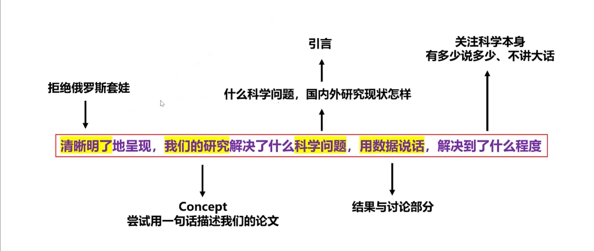

# 寒假做的事情

完成比完美重要，糊弄傻逼足够了兄弟

极力避免重复造轮子，你要去寻找到质量和成本的最大公约数

# 篮球

# 唐朝历史补全

# UE

1.16在涂老师的询问下，玩了十天，我的长征开始了

1.18 

​	绿色三角形是运行 我开发是完全用蓝图

​	按住鼠标右键 	WASD QE进行视角的前后左右下上移动

​	发现UE功能居多贪多嚼不烂 我需要什么再学什么，先画靶子再射箭  control+空格打开资源管理器

​    control+p是搜索资源 选中目标后用control+B就能在资源管理器中定位它

 	一般把蓝图称为类，由蓝图创建的东西称为实例，创建的这个过程称为实例化

在Outline中的基础对象被称之为Actor 每一个actor由其组件component去定义其作用

设置表面对齐可以保证 没有体积重合  选中模型后按enter键能使该模型精确落在下方的模型上

资源外部导入：

​	1.虚幻商城添加到工程

​	2.quixel brige插件 

​			能让工程使用一个3D模型公司quixel出品的各类模型

​	3.外部的3d资源 

​			如free3d maya 3dmax这种第三方网站 ，但适配性不是很好？？要微调

关于变化大小，如果你直接用缩放对象去拉伸的话，表面贴图的材质会被强制拉伸失调，使用画刷设置控制静态物体大小表面贴图就会自适应扩张

导入fbx需要注意几个选项：打开骨骼网格体 导入网格体 导入动画

# 论文

从我的视角出发可以检索粗浅分为三种

​	国内知网  国外letpub 计算机CCF

看刊号 ：国内CN 国外ISSN  CN刊物的下限比较高，因为CN刊物一般有ISSN编号，国内也认CN

核心期刊 

​	国内核心

​		北大核心 南大核心 科技核心 CSCD(中国科学引文数据库)

​	国际核心

​		SCI（理工类）：有JCR和中科院两种划分

​		EI（工程类）

 

**工欲善其事必先利其器 **

文献收集 web of science 谷歌学术哦

文献管理 endnot zoerto

**完成比完美重要**

能新建一个空白的word文档就已经很了不起了，可以奖励自己玩一局大乱斗了

且流水不争先 争的是滔滔不绝，很多人处于“心中有江山的人岂能快意潇洒"   我抗压能力强所以我赢了

摘要 [Abstract](https://zhida.zhihu.com/search?content_id=219298252&content_type=Article&match_order=1&q=Abstract&zhida_source=entity)

​	关键词 [Keywords](https://zhida.zhihu.com/search?content_id=219298252&content_type=Article&match_order=1&q=Keywords&zhida_source=entity)

引言 Introduction

致谢 [Acknowledgments](https://zhida.zhihu.com/search?content_id=219298252&content_type=Article&match_order=1&q=Acknowledgments&zhida_source=entity)

参考文献 References

结论 Conclusions

结语 Concluding remarks

启示 [Implications](https://zhida.zhihu.com/search?content_id=219298252&content_type=Article&match_order=1&q=Implications&zhida_source=entity)

建议 [Recommendations](https://zhida.zhihu.com/search?content_id=219298252&content_type=Article&match_order=1&q=Recommendations&zhida_source=entity)

国内外 in China and abroad

得到越来越多的应用 has been increasingly applied

一直是比较担心的问题 sth remains a cause for concern

未来研究 [in the future](https://zhida.zhihu.com/search?content_id=219298252&content_type=Article&match_order=1&q=in+the+future&zhida_source=entity), [or future research](https://zhida.zhihu.com/search?content_id=219298252&content_type=Article&match_order=1&q=or+future+research&zhida_source=entity)

与以前的研究结果一致 concur with/be in line with/be consistent with/coincide with previous findings

提出 propose/propound/assert

指出 highlight/state/argue/conclude/point out/indentify

本文方法 the proposed method/our method

一直都是研究的热点 has attracted considerable research interest

已经逐渐成为xxx领域的研究热点之一 has gradually become a popular research topic in the field of xxx

同时、此外 additionally/along with that/in addition/moreover

原因类的 Owing to/because of/because/This can be explained by/There are *n* reasons

具有很好的应用前景。the application prospect of the xxx system is promising

[**](https://zhida.zhihu.com/search?content_id=219298252&content_type=Article&match_order=1&q=**&zhida_source=entity)*、**、*分别代表1%、5%、10%的显著性水平下显著 ***, **, and * indicate significance at the 1%, 5%, and 10% levels, respectively.

具有参考意义 are informative for/provide references for

xx等人首次研究了 For the first time, xxx et al. investigated

这将有利于未来投入应用 making it beneficial for future applications

局限性 limitations

xx迫在眉睫 xx is an urgent need.

值得注意的是 notably

具有一般意义 of general significance

在 … 背景下 against the backdrop of...

技术“诀窍”technological “know-how”

从本质上 by its very nature

缺点 drawback/disavdange/problem

优缺点 benefits and drawbacks

同理 similarily

同样成立/适用于 sth hold true for

易证 It is evident that

式（1） Equation (1) or Eq. (1)

式中 where

切入点 starting point

学术界 academic community/academia

研究方案 scheme

研究小组 we/the team

亮点及潜力 highlights and potentials

研究意义 rationale， *是指进行这项研究的理由。*

作者单位 Author affliations

以n个地市为研究对象 use *n* cities as study sites

第5卷，第1期，2021年3月，第104-123页 Volume 5, Issue 1, March 2021, Pages 104–123

表3最后一列 last column of Table 3

研究重点 research priorities

文献计量 bibliometrics

插图 inset
