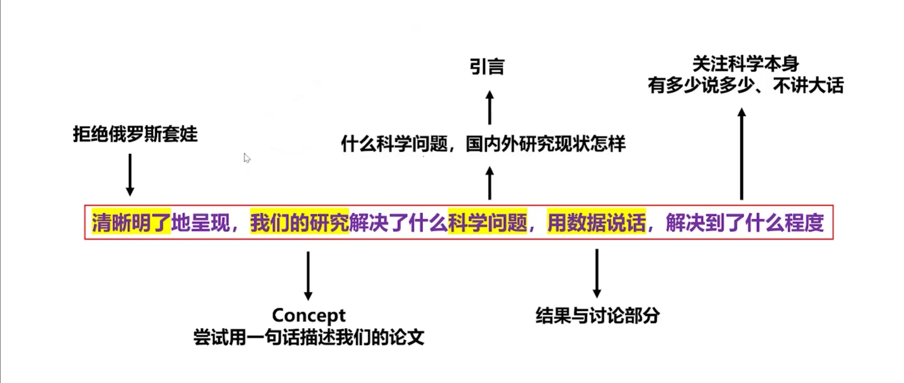

# Paper I

记录一下论文的一点碎碎念，和未来自己可能重复利用的经验。

# 写

这是我之前抄的一个图，我感觉在工科论文里还是普遍适用的，而比较犯难的就是写下第一段话，所谓“完成比完美重要” 后面还可以再改，重要的是踏出第一步，能新建一个论文的word文档就已经很了不起了，可以奖励自己玩两把炉石了。

写的话用Latex写因为期刊会提供模板，而且在字体字号图片位置方面不用操心，overleaf没会员用tex studio编译的。

### 摘要注意

分成四个部分

1.用一句话引出为什么做这个研究

2.用一两句话介绍自己的方法

3.用一两句话直接陈述最重要的研究成果，不用全部都说

​		与Result这一章的区别就是 result要说所有的结果 自己的认知和观点

4.用一两句话做延申和展望

## 画图

拒绝重复造轮子，要寻找质量和成本的最大公约数，我就是站在巨人的肩膀上找了个机器学习的绘画模板开始拼的，后面写别的论文的时候又用了这篇拼好的图片。

## 回

审稿人大部分还是比较专业的，不过有的时候提的问题也够2b的，问我为什么没达到aaai会议某篇论文的水平，我要是达到了我投这个啊，当然性能比不上我基本都是绕着讲，说其他好处，说未来考虑把性能更好的xx模块集成。

