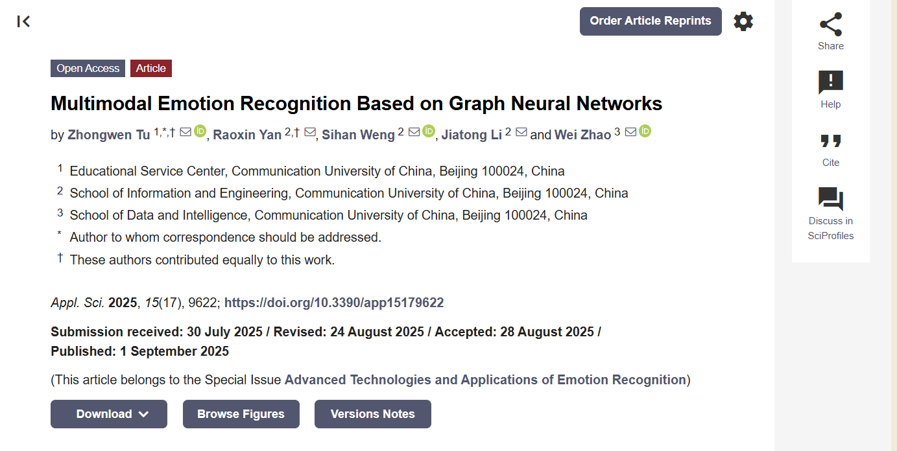
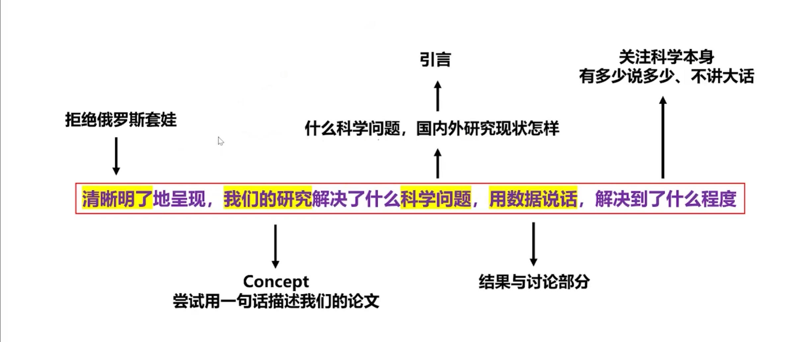

# Paper I

记录一下论文的一点碎碎念，和未来自己可能重复利用的经验。

# 写

这是我之前抄的一个图，我感觉在工科论文里还是普遍适用的，而比较犯难的就是写下第一段话，所谓“完成比完美重要” 后面还可以再改，重要的是踏出第一步，能新建一个论文的word文档就已经很了不起了，可以奖励自己玩两把炉石了。

写的话用Latex写因为期刊会提供模板，而且在字体字号图片位置方面不用操心，overleaf没会员用tex studio编译的。

### 摘要注意

分成四个部分

1.用一句话引出为什么做这个研究

2.用一两句话介绍自己的方法

3.用一两句话直接陈述最重要的研究成果，不用全部都说

​		与Result这一章的区别就是 result要说所有的结果 自己的认知和观点

4.用一两句话做延申和展望

### 翻译

让我用Native的水平写文章不太可能，所以我用LLM GAN 

首先让一个ai翻译：，promp：“我现在要给你一个伟大的翻译任务了，那就是把我的中文论文翻译成英文论文，我要投到IEEE上去，我会把文章一段一段发给你，让你负责翻译成科研论文的格式，请你在每一次的对话中都记得我给你的要求：要保证语法正确，能准确翻译出我的意思，某些术语可能在英文中有不同的词语，请你记住这个英文词，保证你在完成我整个翻译任务时不会出现前文翻译的某个术语和后文翻译的某个术语词语不一样的情况，谢谢，我爱你！”

然后让另一个ai检查

## 画图

拒绝重复造轮子，要寻找质量和成本的最大公约数，我就是站在巨人的肩膀上找了个机器学习的绘画模板开始拼的，后面写别的论文的时候又用了这篇拼好的图片。

## 回

审稿人大部分还是比较专业的，不过有的时候提的问题也够2b的，问我为什么没达到aaai会议某篇论文的水平，我要是达到了我投这个啊，当然性能比不上我基本都是绕着讲，说其他好处，说未来考虑把性能更好的xx模块集成。

## 论文写作的七个原则

听一个讲座讲的，多少有点道理，于是我记了下来

### 原则一：讲好故事原则

写科技论文就是针对一个中心命题讲一个好的故事（tell a good story），需要遵循 7W 原则

问题是什么（What is the engineering/scientific problem?）

为什么重要（Why is it important? What is its significance?）

为什么必要和迫切（What necessitates and urges your research?）

问题的难点是什么（What are the difficulties?）

解决的思路是什么，为什么你能解决（What is your method? What is the magic touch? Why it works?）

主要的结果是什么（What are the main results?）

论文的贡献是什么（What are the contributions?）

### 原则二：组织结构原则

结构化（类似于八股文）写作，易于读者把握文章的组织，方便读者有选择地阅读标题、摘要、关键词、引言、文献综述、正文、讨论、结论与展望，

每个部分都有各自的功能章节开始要有阐明本章节目目的的段落，结束要有连接到下一章节的段落，段首要有阐明整段主题的句子，段尾要有连到下段的过渡句；

从标题到结论都要连贯，句句相扣，段段相连，让一篇论文是一个整体而不是杂乱无章地把句子堆积在一起

研究工作的创新性应该体现在研究内容上，而不应该体现在论文的结构和形式上

### 原则三：新旧信息原则

Put in the topic position the old information that links backward; put in the stress position the new information you want the reader to emphasize.

论文从头到尾要从旧信息过渡到新信息；一个容易理解的句子应该从读者熟悉的（或刚刚提过的）信息开始而以新信息结束，并在它们之间平滑过渡；永远不要在句子的开头引入新信息，切忌在术语被定义之前使用

新信息和旧信息对作者来说可能不是很好区分，因为他非常熟悉所有的信息。为了避免这种问题，不管什么时候，每当你开始写新句，你应该问问自己，这些词前面有没有被提到过。一定要把提到过的放前面，没提过的放后面。

### 原则四：恰当位置原则

Information is interpreted more easily and more uniformly if it is placed where most readers expect to find it.

揣摩和换位思考读者读论文的感受，遵循读者接受信息的习惯和规律，斟酌各部分材料在论文中的最合适的位置论文的章节、段落需要根据写作逻辑不断调整和完善在适当的位置，多做交叉引用，以便前后结论相互印证和相互呼应

Improving the quality of writing actually improves the quality of thought.

### 原则五：长短句式原则

Long sentences can be avoided by limiting each sentence to one or two topics.

一个句子只包含一个话题，尽量用短句，如果无法避免使用长句，句子结构一定要清楚，动词尽量靠近主语，不要太远

读者想在主语之后立刻看到行为动词。对一个说明谁在做什么的句子，读者需要找到动词才能理解。如果动词和主语之间相隔太远，阅读就会被寻找动词打断。而打断阅读就会使句子难以理解。

One can usually recognize a very long sentence by its length – sixty words or more.

### 原则六：可信度递减原则

**便于审稿人 / 读者认同你的论证**

​	可信度更强的证据都同意了，可信度更弱的证据更容易接受

​	多个可信度更强的证据都同意了，可信度更弱的证据更容易接受

**便于审稿人 / 读者将主要精力放在和你不一致的地方**

​	即使审稿人 / 读者不认同你的某一个证据，在此之前的可信度更强的证据他是认同的，他会认真思考为什么不同意当前的证据

**从不同角度、不同层次、不同方面论证，更容易让审稿人 / 读者接受论证**

​	非完全归纳法

​	证据越多，证据之间相互印证，形成证据链

**科技论文写作的论证过程和法院辩护类似**

**原则七**

  开始都是屎 写完就牛逼，不同意我论文牛逼的算那个人有眼无珠
