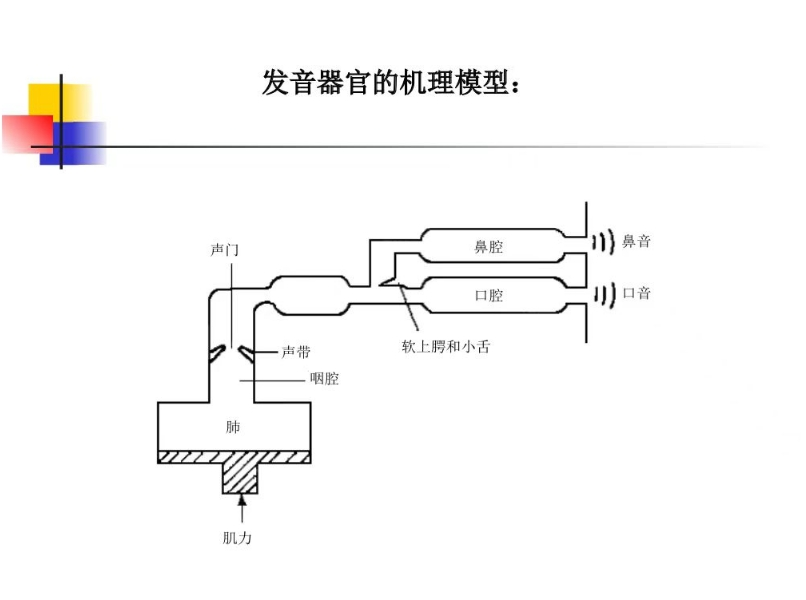

# 声频

声音是波，描述其有多种指标：

声强：单位时间内通过单位界面的波的能量流 

声压：波在传播的时候介质中压强的变化

人是万物之灵，声音在给人听的时候主观感受并不是成线性关系的，所以取对数声压级作为指标，也就是常说的db

 **响度**

响度描述的是声音的响亮程度，表示人耳对声音的主观感受，其计量单位是宋。定义为声压级为40dB的1 kHz纯音的响度为1 Son (宋) 。人耳对声音的感觉，不仅和声压有关，还和频率有关。声压级相同，频率不同的声音，听起来响亮程度也不同。如空压机与电锯，同是100dB声压级的噪声，昕起来电锯声要响得多。按人耳对声音的感觉特性，依据卢压和频率定出人对声音的主观音响感觉量，称为响度级，单位为方，符号phon。根据国际协议规定，OdB声级的1000 Hz纯音的晌度级定义为0 phon。其他频率声音的声级与响度级的对应关系，要从等响度曲线才能查出

# 人体的语音

vocal tract 声道 vowel 元音 consonant 辅音 sonic 声波的 phoneme 音素（语音的最小单位） syllable音节(说话一次发出的语音片段）phonetic语音  phonelogical音韵

语音编码（在语音尽量不失真的情况下，用更少的比特来表示语音）：脉冲编码/自适应预测编码............ 关键技术：线性预测LPC，合成分析法，感觉加权滤波器

语音增强：噪声消除，端点检测   方法：自适应滤波（卡尔曼滤波，维纳），麦克阵列

语音评价：I.由计算机对人的发音质量进行评价评分，可以用来辅助语言学习

​					II.实质上是语音识别的扩展应用

​					III.利用语音识别获取的概率值来判断发音质量的高低

#### 语音分析常用方法：

- [ ] 能量

- [ ]  过零率

- [ ]  基频

- [ ]  共振峰

- [ ]  语谱图

- [ ] 线性预测分析

- [ ] Mel倒谱分析

- [ ] 感知线性预测分析PLP

- [ ]  小波

- [ ] 功率谱

  ####  发音流程：

  肺中的空气受到挤压形成气流（动力区）--------->  气流通过声门（声带）[声源区]--------------->沿着声道（咽喉口腔等组成）[调音区]释放出去 

  语音的特性完全由声门、声道、口鼻决定。将气流声门等效为一个激励源，将声道等效成一个滤波器。
  
  

#### 粗浅的分类一下几种音：

清音/浊音：浊音声带振动，清音声带不振动。  

 元音/辅音：元音发音声道不受阻挡，辅音声道发声受阻挡

按成阻/持阻/除阻方式区分：

塞音/擦音/塞擦音/鼻音/边音：塞音发生部位完全闭合，构成阻碍，气流冲破阻碍  。 b p d t g k

​													擦音留有一条窄缝，气流窄缝中挤出，摩擦成声。f h x sh r s

​													鼻音气流从鼻腔流过    m n 

​													边音舌尖顶住上齿龈，气流从舌头两边通过。 I

爆破音：声道某处完全关闭后压缩空气突然打开声道发出的声音

混合音：某些方言中清音浊流现象

在声学和乐理中很多词是混合用的，基音=基波，其频率为基频，泛音=谐波=频率为基波整数倍的波，谐音是二者之和。

#### 听觉

听见，这一能力的完成依赖三部分：感受器（耳）    +    传入神经   +   神经中枢

耳： 由外耳中耳内耳组成，涉及耳廓外耳道鼓膜听小骨咽鼓管等等器官，从生理角度对这些东西弄个一清二楚负担过重，直接记结论，不求甚解

​			比如耳廓：头戴式耳机为何能爆杀入耳式耳机，因为入耳式耳机没有利用耳廓对于声音中高频的增益，对低频的衰减。

​			听觉方面：人们觉得一个声音和谐不和谐是由频谱中的分布决定的，比如大号的谐音为200hz/400hz/600hz/800hz/1000hz

## 提取基频

Praat自带录音功能，可以选择采样率，采取某个音比如chuan，它的四个声调阴平阳平上声去声都存在字，川传喘串，各录一遍

对其标注，获得TextGrid文件，可以选择 直接提取复制或者采用脚本批量处理

归一化：因为录音的人的有其他变量如口音，音高等等会造成影响，采取对数据进行处理生成五度图来解决，因为数据简单，使用excel就能解决

##   VOT和GAP

声母由辅音consonant构成，对于声母来说，发声分为三个阶段：成阻  持阻 除阻

为方便语谱图观察，一般是说某个字说两遍，观测第二个字的声母。

成阻是前一个字的波形逐渐幅度降低，直至平稳的阶段。持阻是波形平稳直线的阶段，除阻没明显标志。

成阻时间+除阻时间=GAP 一般是测量双音节词，第二个字前的无声字段。

VOT：在塞音连接上后面的元音时，有很短的时间间隔 ，是Voice onset time 

​			因为要生成气流冲破阻碍： 清音的Vot >0，浊音的vot<0

CD=VOT +  GAP

## 舌位图制作

 为了准确和客观描述韵母的发声特点，采用频谱图加以描述，特别是使用共振峰F1/F2

 在前人的研究中发现，第一共振峰F1和第二共振峰F2分别跟舌位的上下和舌位的前后有关系。舌位越前，F2越高。开口度越高，F1越高。 

作业要求制作韵母的舌位图：[【语音学】如何用Praat绘制元音舌位图？_哔哩哔哩_bilibili](https://www.bilibili.com/video/BV1Mw411677e/?spm_id_from=333.880.my_history.page.click)

1.先录自己发音的韵母音频

2.做好标注使用脚本提取数据

3.用excel数据分析。

## 语音评价

**语音的质量评价方法**

**1.** **信噪比(Signal-to-Noise Ratio，SNR)**

SNR一直是衡量针对宽带噪声失真的语音增强算的常规方法。但要计算信噪比必需知道纯净语音信号，但在实际应用中这是不可能的。因此，SNR主要用于纯净语音信号和噪声信号都是己知的算法的仿真中。 

信噪比计算整个时间轴上的语音信号与噪声信号的平均功率之比。

 

**2.** **分段信噪比(Segment Signal-to-Noise Ratio，SegSNR)**

由于语音信号是一种缓慢变化的短时平稳信号，因而在不同时间段上的信噪比也应不一样。为了改善上面的问题，可以采用分段信噪比。

 

**3.** **PESQ(Perceptual Evaluation of Speech Quality)** 

2001年2月，ITU-T推出了P.862 标准《窄带电话网络端到端语音质量和话音编解码器质量的客观评价方法》,推荐使用语音质量感知评价PESQ算法，该建议是基于输入-输出方式的典型算法，效果良好。 

PESQ算法需要带噪的衰减信号和一个原始的参考信号。开始时将两个待比较的语音信号经过电平调整、输入滤波器滤波、时间对准和补偿、听觉变换之后, 分别提取两路信号的参数, 综合其时频特性, 得到PESQ分数, 最终将这个分数映射到主观平均意见分(MOS)。PESQ得分范围在-0.5--4.5之间。得分越高表示语音质量越好。

 

**4.** **对数似然比测度（Log Likelihood Ratio Measure,LLR** 

坂仓距离测度是通过语音信号的线性预测分析来实现的。ISD基于两组线性预测参数(分别从原纯净语音和处理过的语音的同步帧得到)之间的差异。LLR可以看成一种坂仓距离（Itakura Distance,IS），但IS距离需要考虑模型增益。而LLR不考虑模型增益引起的幅度位移，更重视整体谱包络的相似度。

 

**5.** **对数谱距离（log spectral distance，LSD）**

  对数谱距离的定义

**6.** **可短时客观可懂(Short-Time Objective Intelligibility,STOI)**

0-1范围，值越大，可懂度越高

 

**7.** **加权谱倾斜测度**(Weighted Spectral Slope,WSS)

WSS值越小说明扭曲越少，越小越好，范围

## 分帧 提取参数

首先说说为什么要分帧，从来只有见微知著，见著知微的情况少之又少（傅里叶算一个吧） ，整体的结果往往受制于多个音素，硬要强拉关联往往捉襟见肘，比如过零率这个参数，去研究一整段语音的过零率是没有意义的，但是分成一小段的过零率就能用来判断元音辅音（元音谐波结构较为规则，波动小，过零率低，而辅音，特别是爆破音（如 /p/, /t/, /k/）和摩擦音（如 /s/, /f/），其频谱中含有较多的高频成分，过零率高）

1.先进行预加重，抑制低频成分，增强高频成分，因为在语音信号中高频成分能量一般比较低，由于女的基频高，甚至感觉可以拿来当打拳的理由

2.加重完了要进行分帧，分帧理由说了，该怎么分呢，用加窗，窗的作用是平滑帧的边界，使帧的起始部分和结束部分逐渐衰减到0，**减少帧与帧之间的突变**

​	该怎么分呢，用libsora函数把wav导出为一维数组y,以窗函数为帧长 L，帧移为LL,语音长度/帧移=帧数 N，然后将y中的数据导入形状为[N，L]的矩阵，一行来表示一帧的数据，有多少行就是有多少帧。

3.提取参数 

​		短时平均幅度，短时能量，过零率，都有公式，过零率可以讲讲  

​		上文也说了过零率的作用，顺延下来，一整段语音的过零率没有任何意义，一帧的过零率才能有意义，所以在过零率计算的函数中要加入分帧。

​		怎么做呢，先设立一个delta，小于delta的为0不参与讨论，因为很可能是噪音。围棋中分为本手俗手妙手，在计算过零率这边的我觉得可以说是妙手了，过零率用相邻采样点的乘积，小于0说明异号了就是过零了，这边很妙，一般想的都是直接相邻乘，我找的那一段是这样算的，原来分帧的结果是[N,L],提取数据成两个[N,L-1]，一个提取帧的第一个点到倒数第二个点，第二提取帧的第二个点到最后一个点，这样直接用np.multiply相乘（这是逐元素乘法，不是矩阵乘法），就可以完成相邻乘了。

轻轻又松松啊

## 倒谱 特指MFCC

通过一系列操作把音频变为线性的人耳感知，一般用于语音分类器的训练和识别

## 语音识别

ASR ，早期是 结果=声学模型*语言模型 

​							    	↑什么音素 	 ↑ 某种音素对应的词      我说无敌 ，第一个识别wu di  第二个判断是武帝 还是 吴迪 还是 无敌  

声学模型是个提取出来的mfcc 39维的向量           

## 线性预测编码

还没做

## 语音编码

太老了用现成函数把

## 25/4/13补充

在我睡觉前，舍友问了我关于音色是什么，我也很好奇，想了一下回答：

Q：音色是什么

A:    不同频率所占的比例

Q：那按你的说法，频率一样的就是相同的音色呗，可是小提琴和钢琴都演奏do这个音， 可以很明显听出不同

A：

​	是这样的，比如我在钢琴上按下中央C这个键，产生的不仅仅是f0=261.63Hz的这一个音，这是基频，附带的还有一连串由这个音产生的泛音（谐波），频率是基频的整数倍的波比如523hz/784hz等等，这些波组成了我们听到的按动钢琴中央C的声音，小提琴也是同理，一次演奏出多个频率组合而成的音。

​	那让这两者能被显而易见听出区别的是各类谐波的强度不同

| 频率（hz) | 钢琴 | 小提琴 |
| --------- | ---- | ------ |
| 261.63    | 高   | 高     |
| 523.26    | 中等 | 高     |
| 784.89    | 弱   | 中等   |
| 1046.52   | 很弱 | 中等   |

​	

Q：那人体的发声呢

A：肺部是动力区，产生气流到达声带开始振动，产生基频和一系列的泛音，然后经过共鸣腔，不同共鸣腔有不同的共振峰，这些共振峰选择性地放大或抑制不同的频率，使得发出不同的音。比如“睡”这个字的发音，是由声带振动产生二声的基频，然后共鸣腔里改变位置决定音素（如“shui”），通过口腔形状控制元音和辅音的音色。

Q：那么这些音频信号在电脑中是以什么方式储存的呢

A：记录时域波形，根据奈奎斯特采样定律，f采>=2fh，就能获取全部信息。只需要记录时间和对应的振幅值，时间由对应采样点的时间位置来记录，44khz的采样频率，第n个采样点就是第n/44000 秒。

Q：那如果单纯记录振幅值，还是小提琴和钢琴演奏do的例子，假设两者声音大小一样，只采样振幅值，那么结果也应该一样啊，是怎么区别音色呢

A：结果不一样，因为小提琴和钢琴谐波比例不同，也就是频率成分不尽相同，根据傅里叶变换，那么时域波形不会完全一模一样
